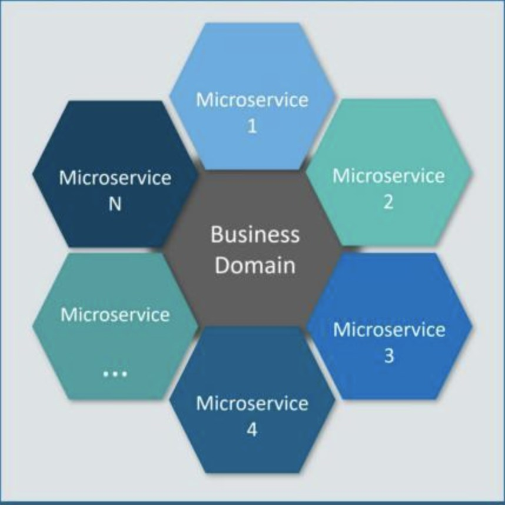
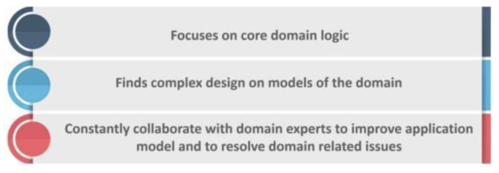

# 学习手册

[TOC]

## 0x01 GO 基础类

### 1 、与其他语言相比，使用 GO 有什么好处？

* 与其他作为学术实验开始的语言不同，Go 代码的设计是务实的。每个功能和语法决策都旨在让程序员的生活更轻松。
* Golang 针对并发进行了优化，并且在规模上运行良好。
* 由于单一的标准代码格式，Golang 通常被认为比其他语言更具可读性。
* 自动垃圾收集明显比 Java 或 Python 更有效，因为它与程序同时执行。

### 2 、GOLANG 使用什么数据类型？

* Method
* Bool
* String
* Array
* Slice
* Struct
* Pointer
* Function
* Interface
* Map
* Channel

### 3 、GO 程序中的包是什么？

包 (pkg) 是 Go 工作区中包含 Go 源文件或其他包的目录。源文件中的每个函
数、变量和类型都存储在链接包中。每个 Go 源文件都属于一个包，该包在文
件顶部使用以下命令声明：

```go
package <packagename>
```

您可以使用以下方法导入和导出包以重用导出的函数或类型

```go
import <packagename>
```

Golang 的标准包是fmt，其中包含格式化和打印功能，如Println().

### 4 、GO 支持什么形式的类型转换？将整数转换为浮点数

Go 支持显式类型转换以满足其严格的类型要求。

```go
i := 55 //int
j := 67.8 //float
sum := i + int(j) //j is converted to int
```

### 5 、什么是  `goroutine` ？你如何停止它？

一个 `goroutine` 是一个函数或方法执行同时旁边其他任何够程采用了特殊的 `goroutine` 线程。`goroutine` 线程比标准线程更轻量级，大多数 Golang 程序同时使用数千个  `goroutine`。

要创建 `goroutine`，请go在函数声明之前添加关键字。

```go
go f(x, y, z)
```

您可以通过向 `goroutine` 发送一个信号通道来停止它。`goroutine` 只能在被告知检查时响应信号，因此您需要在逻辑位置（例如for循环顶部）包含检查。

```go
package main

func main() {
 quit := make(chan bool)
 go func() {
  for {
   select {
   case <-quit:
    return
   default:
   }
  }
 }()
 quit <- true
}

```

### 6 、 如何在运行时检查变量类型？

类型开关(Type Switch)是在运行时检查变量类型的最佳方式。类型开关按类型
而不是值来评估变量。每个 Switch 至少包含一个case用作条件语句，如果没
有一个case 为真，则执行default。

### 7 、GO 两个接口之间可以存在什么关系？

如果两个接口有相同的方法列表，那么他们就是等价的，可以相互赋值。如果
接口A的方法列表是接口B的方法列表的自己，那么接口B可以赋值给接口
A。接口查询是否成功，要在运行期才能够确定

### 8 、GO 当中同步锁有什么特点？作用是什么

当一个 `goroutine` （协程）获得了Mutex后，其他 `goroutine` （协程）就只能乖
乖的等待，除非该 `goroutine` 释放了该Mutex。RWMutex在读锁占用的情况下，
会阻止写，但不阻止读 RWMutex。 在写锁占用情况下，会阻止任何其他
 `goroutine` （无论读和写）进来，整个锁相当于由该 `goroutine` 独占
同步锁的作用是保证资源在使用时的独有性，不会因为并发而导致数据错乱，
保证系统的稳定性。

### 9 、GO 语言当中 CHANNEL（通道）有什么特点，需要注意什么？

如果给一个 nil 的 channel 发送数据，会造成永远阻塞。
如果从一个 nil 的 channel 中接收数据，也会造成永久阻塞。
给一个已经关闭的 channel 发送数据， 会引起 panic
从一个已经关闭的 channel 接收数据， 如果缓冲区中为空，则返回一个零
值。

### 10 、GO 语言当中 CHANNEL 缓冲有什么特点？

无缓冲的 channel是同步的，而有缓冲的channel是非同步的。

### 11 、Go 语言中 cap 函数可以作用于哪些内容？

可以作用于的类型有：

* array(数组)
* slice(切片)
* channel(通道)

### 12 、GO CONVEY 是什么？一般用来做什么？

* go convey是一个支持Golang的单元测试框架
* go convey能够自动监控文件修改并启动测试，并可以将测试结果实时输出
到Web界面
* go convey提供了丰富的断言简化测试用例的编写

### 13 、Go 语言当中 new的作用是什么？

new的作用是初始化一个内置类型的指针new函数是内建函数，函数定义：

```go
func new(Type) *Type
```

* 使用new函数来分配空间
* 传递给new函数的是一个类型，而不是一个值
* 返回值是指向这个新分配的地址的指针

### 14 、GO 语言中 MAKE 的作用是什么？

make的作用是为slice, map or chan的初始化 然后返回引用 make函数是内
建函数，函数定义：

```go
func make(Type, size IntegerType) Type
```

make(T, args)函数的目的和new(T)不同 仅仅用于创建slice, map,
channel 而且返回类型是实例

### 15 、Printf()，Sprintf()，FprintF() 都是格式化输出，有什么不同？

虽然这三个函数，都是格式化输出，但是输出的目标不一样
Printf是标准输出，一般是屏幕，也可以重定向。
Sprintf()是把格式化字符串输出到指定的字符串中。
Fprintf()是把格式化字符串输出到文件中。

### 16 、GO 语言当中数组和切片的区别是什么？

* 数组

数组固定长度。数组长度是数组类型的一部分，所以[3]int和[4]int是两种不
同的数组类型数组需要指定大小，不指定也会根据初始化，自动推算出大小，
大小不可改变。数组是通过值传递的。

* 切片

切片可以改变长度。切片是轻量级的数据结构，三个属性，指针，长度，容量
不需要指定大小切片是地址传递（引用传递）可以通过数组来初始化，也可以
通过内置函数make()来初始化，初始化的时候len=cap，然后进行扩容。

### 17 、GO 语言当中值传递和地址传递（引用传递）如何运用？有什么区别？举例说明

* 值传递只会把参数的值复制一份放进对应的函数，两个变量的地址不同不可相互修改
* 地址传递(引用传递)会将变量本身传入对应的函数，在函数中可以对该变量进行值内容的修改

### 18 、GO 语言当中数组和切片在传递的时候的区别是什么？

1. 数组是值传递
2. 切片是引用传递

### 19 、GO 语言是如何实现切片扩容的？

```go
func main() {
arr := make([]int, 0)
for i := 0; i < 2000; i++ {
fmt.Println("len为", len(arr), "cap为", cap(arr))
arr = append(arr, i)
}
}
```

我们可以看下结果:
依次是`0,1,2,4,8,16,32,64,128,256,512` 但到了 1024 之后,就变成了`1024,1280,1696`

每次都是扩容了四分之一左右

### 20 、看下面代码的 DEFER 的执行顺序是什么？ DEFER的作用和特点是什么？

defer的作用是：
你只需要在调用普通函数或方法前加上关键字defer，就完成了defer所需要
的语法。当defer语句被执行时，跟在defer后面的函数会被延迟执行。直到
包含该defer语句的函数执行完毕时，defer后的函数才会被执行，不论包含
defer语句的函数是通过return正常结束，还是由于panic导致的异常结束。
你可以在一个函数中执行多条defer语句，它们的执行顺序与声明顺序相反。

**defer的常用场景：**

* defer语句经常被用于处理成对的操作，如打开、关闭、连接、断开连接、
加锁、释放锁。
* 通过defer机制，不论函数逻辑多复杂，都能保证在任何执行路径下，资
源被释放。
* 释放资源的defer应该直接跟在请求资源的语句后。

### 21 、GOLANG SLICE 的底层实现

切片是基于数组实现的，它的底层是数组，它自己本身非常小，可以理解为对
底层数组的抽象。因为基于数组实现，所以它的底层的内存是连续分配的，效
率非常高，还可以通过索引获得数据。
切片本身并不是动态数组或者数组指针。它内部实现的数据结构通过指针引用
底层数组，设定相关属性将数据读写操作限定在指定的区域内。切片本身是一
个只读对象，其工作机制类似数组指针的一种封装。

**切片对象非常小，是因为它是只有 3 个字段的数据结构：**

* 指向底层数组的指针
* 切片的长度
* 切片的容量

### 22 、GOLANG SLICE 的扩容机制，有什么注意点？

**Go 中切片扩容的策略是这样的：**

* 首先判断，如果新申请容量大于 2 倍的旧容量，最终容量就是新申请的容量
* 否则判断，如果旧切片的长度小于 1024 ，则最终容量就是旧容量的两倍
* 否则判断，如果旧切片长度大于等于 1024 ，则最终容量从旧容量开始循环增加原来的 1/4, 直到最终容量大于等于新申请的容量
* 如果最终容量计算值溢出，则最终容量就是新申请容量

### 23 、扩容前后的 SLICE 是否相同？

**情况一：**

原数组还有容量可以扩容（实际容量没有填充完），这种情况下，扩容以后的数组还是指向原来的数组，对一个切片的操作可能影响多个指针指向相同地址的Slice。

**情况二：**

原来数组的容量已经达到了最大值，再想扩容， Go 默认会先开一片内存区
域，把原来的值拷贝过来，然后再执行 append() 操作。这种情况丝毫不影响
原数组。
要复制一个Slice，最好使用Copy函数。

### 24 、GOLANG 的参数传递、引用类型

Go语言中所有的传参都是值传递（传值），都是一个副本，一个拷贝。因为拷
贝的内容有时候是非引用类型（int、string、struct等这些），这样就在函
数中就无法修改原内容数据；有的是引用类型（指针、map、slice、chan等这
些），这样就可以修改原内容数据。

Golang的引用类型包括 slice、map 和 channel。它们有复杂的内部结构，除
了申请内存外，还需要初始化相关属性。内置函数 new 计算类型大小，为其分
配零值内存，返回指针。而 make 会被编译器翻译成具体的创建函数，由其分
配内存和初始化成员结构，返回对象而非指针。

### 25 、GOLANG MAP 底层实现

Golang中map的底层实现是一个散列表，因此实现map的过程实际上就是实现
散表的过程。在这个散列表中，主要出现的结构体有两个，一个叫hmap(a
header for a go map)，一个叫bmap(a bucket for a Go map，通常叫其
bucket)。

### 26 、GOLANG MAP 如何扩容

1. 双倍扩容：扩容采取了一种称为“渐进式”的方式，原有的 key 并不会一
    次性搬迁完毕，每次最多只会搬迁 2 个 bucket。
2. 等量扩容：重新排列，极端情况下，重新排列也解决不了，map存储就会蜕
    变成链表，性能大大降低，此时哈希因子hash0的设置，可以降低此类极
    端场景的发生。

### 27 、GOLANG MAP 查找

Go语言中map采用的是哈希查找表，由一个key通过哈希函数得到哈希值， 64
位系统中就生成一个64bit的哈希值，由这个哈希值将key对应存到不同的桶
（bucket）中，当有多个哈希映射到相同的的桶中时，使用链表解决哈希冲
突。
细节：key经过hash后共 64 位，根据hmap中B的值，计算它到底要落在哪个
桶时，桶的数量为2^B，如B=5，那么用 64 位最后 5 位表示第几号桶，在用

hash值的高 8 位确定在bucket中的存储位置，当前bmap中的bucket未找
到，则查询对应的overflow bucket，对应位置有数据则对比完整的哈希值，
确定是否是要查找的数据。如果当前map处于数据搬移状态，则优先从
oldbuckets查找。

### 28 、介绍一下 CHANNEL

Go语言中，不要通过共享内存来通信，而要通过通信来实现内存共享。Go的
CSP(Communicating Sequential Process)并发模型，中文可以叫做通信顺序进
程，是通过 `goroutine` 和channel来实现的。
channel收发遵循先进先出FIFO的原则。分为有缓冲区和无缓冲区，channel
中包括buffer、sendx和recvx收发的位置(ring buffer记录实现)、sendq、
recv。当channel因为缓冲区不足而阻塞了队列，则使用双向链表存储。

### 29 、GO 语言的 CHANNEL 特性？

1. 给一个 nil channel 发送数据，造成永远阻塞
2. 从一个 nil channel 接收数据，造成永远阻塞
3. 给一个已经关闭的 channel 发送数据，引起 panic
4. 从一个已经关闭的 channel 接收数据，如果缓冲区中为空，则返回一个零
    值
5. 无缓冲的channel是同步的，而有缓冲的channel是非同步的
6. 关闭一个nil channel将会发生panic

### 30 、CHANNEL 的 RING BUFFER 实现

channel 中使用了 ring buffer（环形缓冲区) 来缓存写入的数据。ring
buffer 有很多好处，而且非常适合用来实现 FIFO 式的固定长度队列。

**在 channel 中，ring buffer 的实现如下：**


上图展示的是一个缓冲区为 8 的channel buffer，recvx指向最早被读取的数据，sendx指向再次写入时插入的位置。

## 0x02 GO 并发编程

### 1 、MUTEX 几种状态

* mutexLocked — 表示互斥锁的锁定状态；
* mutexWoken — 表示从正常模式被从唤醒；
* mutexStarving — 当前的互斥锁进入饥饿状态；
* waitersCount — 当前互斥锁上等待的 `goroutine` 个数；

### 2 、MUTEX 正常模式和饥饿模式

**正常模式（非公平锁）:**

正常模式下，所有等待锁的 `goroutine` 按照FIFO（先进先出）顺序等待。唤醒
的 `goroutine` 不会直接拥有锁，而是会和新请求 `goroutine` 竞争锁。新请求的
 `goroutine` 更容易抢占：因为它正在CPU上执行，所以刚刚唤醒的 `goroutine` 有很大可能在锁竞争中失败。在这种情况下，这个被唤醒的 `goroutine` 会加入
到等待队列的前面。

**饥饿模式（公平锁）:**

为了解决了等待 `goroutine` 队列的长尾问题
饥饿模式下，直接由unlock把锁交给等待队列中排在第一位的 `goroutine`  (队
头)，同时，饥饿模式下，新进来的 `goroutine` 不会参与抢锁也不会进入自旋状
态，会直接进入等待队列的尾部。这样很好的解决了老的 `goroutine` 一直抢不
到锁的场景。
饥饿模式的触发条件：当一个 `goroutine` 等待锁时间超过 1 毫秒时，或者当前
队列只剩下一个 `goroutine` 的时候，Mutex切换到饥饿模式。

**总结:**

对于两种模式，正常模式下的性能是最好的， `goroutine` 可以连续多次获取
锁，饥饿模式解决了取锁公平的问题，但是性能会下降，这其实是性能和公平
的一个平衡模式。

### 3 、MUTEX 允许自旋的条件

* 锁已被占用，并且锁不处于饥饿模式。
* 积累的自旋次数小于最大自旋次数（active_spin=4）。
* CPU核数大于 1 。
* 有空闲的P。
* 当前 `goroutine` 所挂载的P下，本地待运行队列为空。

### 4 、RWMUTEX 实现

通过记录readerCount 读锁的数量来进行控制，当有一个写锁的时候，会将读
锁数量设置为负数1<<30。目的是让新进入的读锁等待之前的写锁释放通知读
锁。同样的当有写锁进行抢占时，也会等待之前的读锁都释放完毕，才会开始
进行后续的操作。 而等写锁释放完之后，会将值重新加上1<<30, 并通知刚才
新进入的读锁（rw.readerSem），两者互相限制。

### 5 、RWMUTEX 注意事项

* RWMutex 是单写多读锁，该锁可以加多个读锁或者一个写锁
* 读锁占用的情况下会阻止写，不会阻止读，多个 `goroutine` 可以同时获取读锁
* 写锁会阻止其他 `goroutine`（无论读和写）进来，整个锁由该 `goroutine` 独占
* 适用于读多写少的场景
* RWMutex 类型变量的零值是一个未锁定状态的互斥锁
* RWMutex 在首次被使用之后就不能再被拷贝
* RWMutex 的读锁或写锁在未锁定状态，解锁操作都会引发 panic
* RWMutex 的一个写锁去锁定临界区的共享资源，如果临界区的共享资源已
被（读锁或写锁）锁定，这个写锁操作的 `goroutine` 将被阻塞直到解锁
* RWMutex 的读锁不要用于递归调用，比较容易产生死锁
* RWMutex 的锁定状态与特定的 `goroutine` 没有关联。一个 `goroutine` 可
以 RLock（Lock），另一个 `goroutine` 可以 RUnlock（Unlock）
* 写锁被解锁后，所有因操作锁定读锁而被阻塞的 `goroutine` 会被唤醒，并
都可以成功锁定读锁
* 读锁被解锁后，在没有被其他读锁锁定的前提下，所有因操作锁定写锁而
被阻塞的  `goroutine` ，其中等待时间最长的一个 `goroutine` 会被唤醒

### 6 、COND 是什么

Cond实现了一种条件变量，可以使用在多个Reader等待共享资源ready的场
景（如果只有一读一写，一个锁或者channel就搞定了）

每个Cond都会关联一个Lock（*sync.Mutex or*sync.RWMutex），当修改条
件或者调用Wait方法时，必须加锁，保护condition。

### 7 、BROADCAST 和 SIGNAL 区别

```go
func (c *Cond) Broadcast()
```

Broadcast会唤醒所有等待c的 `goroutine` 。
调用Broadcast的时候，可以加锁，也可以不加锁。

```go
func (c *Cond) Signal()
```

Signal只唤醒 1 个等待c的 `goroutine` 。
调用Signal的时候，可以加锁，也可以不加锁。

### 8 、COND 中 WAIT 使用

```go
func (c *Cond) Wait()
```

`Wait()` 会自动释放 `c.L`锁，并挂起调用者的 `goroutine` 。之后恢复执行，
`Wait()` 会在返回时对c.L加锁。
除非被Signal或者Broadcast唤醒，否则Wait()不会返回。
由于Wait()第一次恢复时，C.L并没有加锁，所以当Wait返回时，调用者通常
并不能假设条件为真。如下代码：。
取而代之的是, 调用者应该在循环中调用Wait。（简单来说，只要想使用
condition，就必须加锁。）

```go
c.L.Lock()
for !condition() {
c.Wait()
}
... make use of condition ...
c.L.Unlock()
```

### 9 、WAITGROUP 用法

一个 `WaitGroup` 对象可以等待一组协程结束。使用方法是：

1. `main` 协程通过调用 `wg.Add(delta int)` 设置 `worker` 协程的个数，然后创
建 `worker` 协程；
2. `worker` 协程执行结束以后，都要调用 `wg.Done()`；
3. `main` 协程调用 `wg.Wait()` 且被 `block`，直到所有 `worker`协程全部执行结束
后返回。

### 10 、WAITGROUP 实现原理

* WaitGroup主要维护了 2 个计数器，一个是请求计数器 v，一个是等待计数
器 w，二者组成一个64bit的值，请求计数器占高32bit，等待计数器占低
32bit。
* 每次Add执行，请求计数器v加 1 ，Done方法执行，等待计数器减 1 ，v为
0 时通过信号量唤醒Wait()。

### 11 、什么是 SYNC.ONCE

* Once 可以用来执行且仅仅执行一次动作，常常用于单例对象的初始化场
景。
* Once 常常用来初始化单例资源，或者并发访问只需初始化一次的共享资
源，或者在测试的时候初始化一次测试资源。

* sync.Once 只暴露了一个方法 Do，你可以多次调用 Do 方法，但是只有第
一次调用 Do 方法时 f 参数才会执行，这里的 f 是一个无参数无返回值
的函数。

### 12 、什么操作叫做原子操作

原子操作即是进行过程中不能被中断的操作，针对某个值的原子操作在被进行
的过程中，CPU 绝不会再去进行其他的针对该值的操作。为了实现这样的严谨
性，原子操作仅会由一个独立的 CPU 指令代表和完成。原子操作是无锁的，常
常直接通过 CPU 指令直接实现。 事实上，其它同步技术的实现常常依赖于原
子操作

### 13 、原子操作和锁的区别

原子操作由底层硬件支持，而锁则由操作系统的调度器实现
锁应当用来保护一段逻辑，对于一个变量更新的保护
原子操作通常执行上会更有效率，并且更能利用计算机多核的优势，如果要更
新的是一个复合对象，则应当使用atomic.Value封装好的实现。

### 14 、什么是 CAS

CAS的全称为 `Compare And Swap`，直译就是比较交换。是一条CPU的原子指
令，其作用是让CPU先进行比较两个值是否相等，然后原子地更新某个位置的
值，其实现方式是给予硬件平台的汇编指令，在intel的CPU中，使用的
cmpxchg指令，就是说CAS是靠硬件实现的，从而在硬件层面提升效率。

**简述过程是这样:**

假设包含 3 个参数内存位置(V)、预期原值(A)和新值(B)。V表示要更新变量的
如果V值和E值不同，则说明已经有其他线程在做更新，则当前线程什么都不
做，最后CAS返回当前V的真实值。CAS操作时抱着乐观的态度进行的，它总
是认为自己可以成功完成操作。基于这样的原理，CAS操作即使没有锁，也可
以发现其他线程对于当前线程的干扰

### 15 、SYNC.POOL 有什么用

对于很多需要重复分配、回收内存的地方，sync.Pool 是一个很好的选择。频
繁地分配、回收内存会给 GC 带来一定的负担，严重的时候会引起 CPU 的毛
刺。而 sync.Pool 可以将暂时将不用的对象缓存起来，待下次需要的时候直
接使用，不用再次经过内存分配，复用对象的内存，减轻 GC 的压力，提升系
统的性能。

## 0x03 GO RUNTIME

### 1 、 `goroutine`  定义

Golang 在语言级别支持协程，称之为  `goroutine` 。Golang 标准库提供的所有
系统调用操作(包括所有的同步 I/O 操作)，都会出让 CPU 给其他
 `goroutine` 。这让 `goroutine` 的切换管理不依赖于系统的线程和进程，也不依
赖于 CPU 的核心数量，而是交给 Golang 的运行时统一调度。

### 2 、GMP 指的是什么

`G`（ `Goroutine` ）：我们所说的协程，为用户级的轻量级线程，每个 `goroutine` 对象中的sched保存着其上下文信息。

`M`（`Machine`）：对内核级线程的封装，数量对应真实的CPU数（真正干活的对象）。

`P`（`Processor`）：即为G和M的调度对象，用来调度G和M之间的关联关系，其数量可通过`GOMAXPROCS()`来设置，默认为核心数。

### 3 、1.0之前 GM 调度模型

调度器把G都分配到M上，不同的G在不同的M并发运行时，都需要向系统申
请资源，比如堆栈内存等，因为资源是全局的，就会因为资源竞争照成很多性
能损耗。为了解决这一的问题go从1.1版本引入，在运行时系统的时候加入p
对象，让P去管理这个G对象，M想要运行G，必须绑定P，才能运行P所管理
的G。

**GM调度存在的问题：**

1. 单一全局互斥锁（`Sched.Lock`）和集中状态存储
2. `goroutine`  传递问题（M 经常在 M 之间传递”可运行”的  `goroutine` ）
3. 每个M做内存缓存，导致内存占用过高，数据局部性较差
4. 频繁`syscall`调用，导致严重的线程阻塞/解锁，加剧额外的性能损耗。

### 4 、GMP 调度流程


* 每个P有个局部队列，局部队列保存待执行的 `goroutine` （流程 2 ），当M
绑定的P的的局部队列已经满了之后就会把 `goroutine` 放到全局队列（流
程 2 - 1 ）
* 每个P和一个M绑定，M是真正的执行P中 `goroutine` 的实体（流程 3 ），
M从绑定的P中的局部队列获取G来执行
* 当M绑定的P的局部队列为空时，M会从全局队列获取到本地队列来执行G
（流程3.1），当从全局队列中没有获取到可执行的G时候，M会从其他P
的局部队列中偷取G来执行（流程3.2），这种从其他P偷的方式称为
work stealing
* 当G因系统调用（`syscall`）阻塞时会阻塞M，此时P会和M解绑即hand
off，并寻找新的idle的M，若没有idle的M就会新建一个M（流程5.1）
* 当G因channel或者network I/O阻塞时，不会阻塞M，M会寻找其他
`runnable`的G；当阻塞的G恢复后会重新进入`runnable`进入P队列等待执
行（流程5.3）

### 5 、GMP 中 WORK STEALING 机制

获取P本地队列，当从绑定 P 本地runq上找不到可执行的g，尝试从全局链
表中拿，再拿不到从 `netpoll` 和事件池里拿，最后会从别的 P 里偷任务。P
此时去唤醒一个M。P继续执行其它的程序。M寻找是否有空闲的P，如果有则
将该G对象移动到它本身。接下来M执行一个调度循环（调用G对象->执行->
清理线程→继续找新的 `goroutine` 执行）

### 6 、GMP 中 HAND OFF 机制

当本线程M因为G进行的系统调用阻塞时，线程释放绑定的P，把P转移给其空闲的M执行
细节：当发生上线文切换时，需要对执行现场进行保护，以便下次被调度执行
时进行现场恢复。Go调度器M的栈保存在G对象上，只需要将M所需要的寄存
器（SP、PC等）保存到G对象上就可以实现现场保护。当这些寄存器数据被保
护起来，就随时可以做上下文切换了，在中断之前把现场保存起来。如果此时
G任务还没有执行完，M可以将任务重新丢到P的任务队列，等待下一次被调度
执行。当再次被调度执行时，M通过访问G的vdsoSP、vdsoPC寄存器进行现场
恢复（从上次中断位置继续执行）。

### 7 、协作式的抢占式调度

在1.14版本之前，程序只能依靠 `goroutine` 主动让出 CPU 资源才能触发调
度。这种方式存在问题有：

* 某些 `goroutine` 可以长时间占用线程，造成其它 `goroutine` 的饥饿
* 垃圾回收需要暂停整个程序（Stop-the-world，STW），最长可能需要几分
钟的时间，导致整个程序无法工作

### 8 、基于信号的抢占式调度

在任何情况下，Go运行时并行执行（注意，不是并发）的 `goroutine` 数量是
小于等于 P 的数量的。为了提高系统的性能，P 的数量肯定不是越小越好，所
以官方默认值就是 CPU 的核心数，设置的过小的话，如果一个持有 P 的 M，
由于 P 当前执行的 G 调用了 `syscall` 而导致 M 被阻塞，那么此时关键点：
GO 的调度器是迟钝的，它很可能什么都没做，直到 M 阻塞了相当长时间以
后，才会发现有一个 P/M 被 `syscall` 阻塞了。然后，才会用空闲的 M 来强这
个 P。通过 sysmon 监控实现的抢占式调度，最快在20us，最慢在 10 - 20ms才
会发现有一个 M 持有 P 并阻塞了。操作系统在 1ms 内可以完成很多次线程调
度（一般情况1ms可以完成几十次线程调度），Go 发起 `IO/syscall` 的时候执
行该 G 的 M 会阻塞然后被OS调度走，P什么也不干，sysmon 最慢要 10 - 20ms
才能发现这个阻塞，说不定那时候阻塞已经结束了，这样宝贵的P资源就这么
被阻塞的M浪费了。

### 9 、GMP 调度过程中存在哪些阻塞

* I/O，select
* block on syscall
* channel
* 等待锁
* runtime.Gosched()

### 10 、SYSMON 有什么作用

Sysmon 也叫监控线程，变动的周期性检查，好处

* 释放闲置超过 5 分钟的 span 物理内存；
* 如果超过 2 分钟没有垃圾回收，强制执行；
* 将长时间未处理的 `netpoll` 添加到全局队列；
* 向长时间运行的 G 任务发出抢占调度（超过10ms的g，会进行
retake）；
* 收回因 `syscall` 长时间阻塞的 P；

### 11 、三色标记原理

我们首先看一张图，大概就会对 三色标记法有一个大致的了解


**原理:**

* 首先把所有的对象都放到白色的集合中
* 从根节点开始遍历对象，遍历到的白色对象从白色集合中放到灰色集合中
* 遍历灰色集合中的对象，把灰色对象引用的白色集合的对象放入到灰色集
合中，同时把遍历过的灰色集合中的对象放到黑色的集合中
* 循环步骤 3 ，知道灰色集合中没有对象
* 步骤 4 结束后，白色集合中的对象就是不可达对象，也就是垃圾，进行回收

### 12 、写屏障

Go在进行三色标记的时候并没有STW，也就是说，此时的对象还是可以进行修改。

**那么我们考虑一下，下面的情况:**


我们在进行三色标记中扫描灰色集合中，扫描到了对象A，并标记了对象A的
所有引用，这时候，开始扫描对象D的引用，而此时，另一个 `goroutine` 修改
了D->E的引用，变成了如下图所示:


这样会不会导致E对象就扫描不到了，而被误认为白色对象，也就是垃圾写屏障就是为了解决这样的问题，引入写屏障后，在上述步骤后，E会被认为是存活的，即使后面E被A对象抛弃，E会被在下一轮的GC中进行回收，这一轮GC中是不会对对象E进行回收的。

### 13 、插入写屏障

Go GC 在混合写屏障之前，一直是插入写屏障，由于栈赋值没有 hook 的原
因，栈中没有启用写屏障，所以有 `STW`。Golang 的解决方法是：只是需要在结
束时启动 `STW` 来重新扫描栈。这个自然就会导致整个进程的赋值器卡顿。

### 14 、删除写屏障

Golang没有这一步，Golang 的内存写屏障是由插入写屏障到混合写屏障过渡
的。简单介绍一下，一个对象即使被删除了最后一个指向它的指针也依旧可以
活过这一轮，在下一轮GC中才被清理掉。

### 15 、混合写屏障

* `混合写屏障`继承了插入写屏障的优点，起始无需 STW 打快照，直接并发扫描垃圾即可；
* `混合写屏障`继承了删除写屏障的优点，赋值器是黑色赋值器，GC期间，任何在栈上创建的新对象，均为黑色。
扫描过一次就不需要扫描了，这样就消除了插入写屏障时期最后 STW 的重新扫描栈；
* `混合写屏障`扫描精度继承了删除写屏障，比插入写屏障更低，随着带来的是 GC 过程全程无 STW；
* `混合写屏障`扫描栈虽然没有 STW，但是扫描某一个具体的栈的时候，还是要停止这个 `goroutine` 赋值器的工作（针对一个 `goroutine` 栈来说，是暂停扫的，要么全灰，要么全黑哈，原子状态切换）。

### 16 、GC 触发时机

**主动触发** ：

调用 runtime.GC

**被动触发** ：

使用系统监控，该触发条件由runtime.forcegcperiod变量控制，默认为 2 分
钟。当超过两分钟没有产生任何 GC 时，强制触发 GC。
使用步调（Pacing）算法，其核心思想是控制内存增长的比例。如Go 的 GC
是一种比例 GC, 下一次 GC 结束时的堆大小和上一次 GC 存活堆大小成比例.

### 17 、GO 语言中 GC 的流程是什么？

**Go1.14版本以 STW 为界限，可以将 GC 划分为五个阶段：**

* GCMark 标记准备阶段，为并发标记做准备工作，启动写屏障
* STWGCMark 扫描标记阶段，与赋值器并发执行，写屏障开启并发
* GCMarkTermination 标记终止阶段，保证一个周期内标记任务完成，停止写屏障
* GCoff 内存清扫阶段，将需要回收的内存归还到堆中，写屏障关闭
* GCoff 内存归还阶段，将过多的内存归还给操作系统，写屏障关闭。

### 18 、GC 如何调优

**通过go tool pprof 和 go tool trace等工具：**

* 控制内存分配的速度，限制 `goroutine` 的数量，从而提高赋值器对 CPU 的利用率。
* 减少并复用内存，例如使用 sync.Pool 来复用需要频繁创建临时对象，例如提前分配足够的内存来降低多余的拷贝。
* 需要时，增大 GOGC 的值，降低 GC 的运行频率。

## 0x04 微服务

### 1 、您对微服务有何了解？

微服务，又称微服务架构，是一种架构风格，它将应用程序构建为以业务领域
为模型的小型自治服务集合
通俗地说，你必须看到蜜蜂如何通过对齐六角形蜡细胞来构建它们的蜂窝状
物。他们最初从使用各种材料的小部分开始，并继续从中构建一个大型蜂箱
这些细胞形成图案，产生坚固的结构，将蜂窝的特定部分固定在一起
这里，每个细胞独立于另一个细胞，但它也与其他细胞相关。这意味着对一个
细胞的损害不会损害其他细胞，因此，蜜蜂可以在不影响完整蜂箱的情况下重
建这些细胞。


```img
图 1 ：微服务的蜂窝表示 – 微服务访谈问题
```

请参考上图。这里，每个六边形形状代表单独的服务组件。与蜜蜂的工作类
似，每个敏捷团队都使用可用的框架和所选的技术堆栈构建单独的服务组件
就像在蜂箱中一样，每个服务组件形成一个强大的微服务架构，以提供更好的
可扩展性。此外，敏捷团队可以单独处理每个服务组件的问题，而对整个应用
程序没有影响或影响最小

### 2 、说说微服务架构的优势

| 优势| 说明 |
| :-----| :---- |
| 独立开发  | 所有微服务都可以根据各自的功能轻松开发|
| 独立部署 | 根据他们所提供的服务，可以在任何应用中单独部署 |
| 故障隔离| 即使应用中的一个服务不起作用，系统仍然继续运行|
| 混合技术栈| 可以用不同的语言和技术来构建同一应用程序的不同服务|
| 粒度缩放| 各个组件可根据需要进行扩展，无需将所有组件融合到一起|

### 3 、微服务有哪些特点？

* 解耦—系统内的服务很大程度上是分离的。因此，整个应用程序可以轻松构建，更改和扩展
* 组件化—微服务被视为可以轻松更换和升级的独立组件
* 业务能力—微服务非常简单，专注于单一功能
* 自治—开发人员和团队可以彼此独立工作，从而提高速度
* 持续交付—通过软件创建，测试和批准的系统自动化，允许频繁发布软件
* 责任—微服务不关注应用程序作为项目。相反，他们将应用程序视为他们负责的产品
* 分散治理—重点是使用正确的工具来做正确的工作。这意味着没有标准化
* 模式或任何技术模式。开发人员可以自由选择最有用的工具来解决他们的问题

* 敏捷—微服务支持敏捷开发。任何新功能都可以快速开发并再次丢弃

### 4 、设计微服务的最佳实践是什么？

* 以下是设计微服务的最佳实践


```img
图 6 ：设计微服务的最佳实践 – 微服务访谈问题
```

### 5 、微服务架构如何运作？

**微服务架构具有以下组件:**

* 客户端 – 来自不同设备的不同用户发送请求
* 身份提供商 – 验证用户或客户身份并颁发安全令牌
* API 网关 – 处理客户端请求
* 静态内容 – 容纳系统的所有内容
* 管理 – 在节点上平衡服务并识别故障
* 服务发现 – 查找微服务之间通信路径的指南
* 网络 – 代理服务器及其数据中心的分布式网络
* 远程服务 – 启用驻留在 IT 设备网络上的远程访问信息

### 6 、微服务架构的优缺点是什么？

| 微服务架构的优点 |微服务架构的缺点|
|:------|:------|
| 自由使用不同的技术 |增加故障排除挑战|
| 每个微服务都侧重于单一功能 |由于远程调用而增加延迟|
|支持单个可部署单元 |增加了配置和其他操作的工作量|
| 允许经常发布软件 |难以保持交易安全|
| 确保每项服务的安全性 |艰难地跨越各种便捷跟踪数据|
| 多个服务是并行开发和部署的 |难以在服务之间进行编码|

### 7 、单片，SOA 和微服务架构有什么区别？


`单片 SOA 和微服务之间的比较 – 微服务访谈问题`

* 单片架构类似于大容器，其中应用程序的所有软件组件组装在一起并紧密封装
* 一个面向服务的架构是一种相互通信服务的集合。通信可以涉及简单的数据传递，也可以涉及两个或多个协调某些活动的服务
* 微服务架构是一种架构风格，它将应用程序构建为以业务域为模型的小型自治服务集合

### 8 、在使用微服务架构时，您面临哪些挑战？

**开发一些较小的微服务听起来很容易，但开发它们时经常遇到的挑战如下:**

* 自动化组件：难以自动化，因为有许多较小的组件。因此，对于每个组件，我们必须遵循 Build，Deploy 和 Monitor 的各个阶段。
* 易感性：将大量组件维护在一起变得难以部署，维护，监控和识别问题。它需要在所有组件周围具有很好的感知能力。
* 配置管理：有时在各种环境中维护组件的配置变得困难。
* 调试：很难找到错误的每一项服务。维护集中式日志记录和仪表板以调试问题至关重要。

### 9 、SOA 和微服务架构之间的主要区别是什么？

**SOA 和微服务之间的主要区别如下:**

|SOA| 微服务|
|:------|:-------|
|遵循“尽可能多的共享”架构方法 |遵循“尽可能少分享”架构方法|
"重要性在于“业务功能”重用| 重要性在于“有界背景”的概念|
|它们有共同的治理和标准| 它们专注于人们的合作和其他选择的自由|
|使用企业服务总线（ESB）进行通信 |简单的消息系统|
|它们支持多种消息协议 |它们使用轻量级协议，如 HTTP/REST 等|
|多线程，有更多的开销来处理I/O |单线程，通常使用锁定I/O处理 Event Loop功能进行非|
|最大化应用程序服务可重用性 |专注于解耦|
|传统的关系数据库更常用| 现代关系数据库更常用|
|系统的变化需要修改整体 |系统的变化是创造一种新的服务|
|DevOps/Continuous Delivery正在变得流行，但还不是主流 |专注于DevOps/持续交付|

### 10 、微服务有什么特点？


`图 7 ：微服务的特征 – 微服务访谈问题`

### 11 、什么是领域驱动设计？


`图 8 ： DDD 原理 – 微服务面试问题`

### 12 、为什么需要域驱动设计（DDD）？


`图 9 ：我们需要 DDD 的因素 – 微服务面试问题`

### 13 、什么是无所不在的语言？

如果您必须定义泛在语言（UL），那么它是特定域的开发人员和用户使用的通
用语言，通过该语言可以轻松解释域。

无处不在的语言必须非常清晰，以便它将所有团队成员放在同一页面上，并以
机器可以理解的方式进行翻译。

### 14 、什么是凝聚力？

模块内部元素所属的程度被认为是凝聚力。

### 15 、什么是耦合？

组件之间依赖关系强度的度量被认为是耦合。一个好的设计总是被认为具有高内聚力和低耦合性。

### 16 、什么是 REST / RESTFUL 以及它的用途是什么？

Representational State Transfer（REST）/ RESTful Web 服务是一种帮助计算机系统通过 Internet
进行通信的架构风格。这使得微服务更容易理解和实现。

微服务可以使用或不使用 RESTful API 实现，但使用 RESTful API 构建松散耦合的微服务总是更容易。

### 17 、什么是不同类型的微服务测试？

在使用微服务时，由于有多个微服务协同工作，测试变得非常复杂。因此，测试分为不同的级别。

* 在底层，我们有面向技术的测试，如单元测试和性能测试。这些是完全自动化的。
* 在中间层面，我们进行了诸如压力测试和可用性测试之类的探索性测试。
* 在顶层， 我们的验收测试数量很少。这些验收测试有助于利益相关者理解和验证软件功能。

## 0x05 容器技术

### 1 、为什么需要 DEVOPS

在当今，软件开发公司在软件新版本发布方面，多尝试通过发布一系列以小的特性改变集为目标的新软件版本，代替发布一个大特性改变集的新软件版本的方式。这种方式有许多优点，诸如，快速的客户反馈，软件质量的保证等。也会获得较高的客户满意度评价。完成这样的软件发布模式，开发公司需要做到:

* 增加软件布署的频率
* 降低新发布版本的失败率
* 缩短修复缺陷的交付时间
* 加快解决版本冲突的问题

DevOps 满足所有这些需求且帮助公司高质完成软件无缝交付的目标。

### 2 、 DOCKER 是什么？

* Docker 是一个容器化平台，它包装你所有开发环境依赖成一个整体，像一个容器。保证项目开发，如开发、测试、发布等各生产环节都可以无缝工作在不同的平台
* Docker 容器：将一个软件包装在一个完整的文件系统中，该文件系统包含运行所需的一切：代码，运行时，系统工具，系统库等。可以安装在服务器上的任何东西。

这保证软件总是运行在相同的运行环境，无需考虑基础环境配置的改变。

### 3 、 DEVOPS 有哪些优势？

**技术优势:**

* 持续的软件交付能力
* 修复问题变得简单
* 更快得解决问题

**商业优势:**

* 更快交付的特性
* 更稳定的操作系统环境
* 更多时间可用于创造价值 (而不是修复 / 维护)

### 4 、CI 服务有什么用途？

CI （Continuous Integration）-- 持续集成服务 -- 主要用于整合团队开发中不同开发者提交到开发仓库中的项目代码变化，并即时整合编译，检查整合编译错误的服务。它需要一天中多次整合编译代码的能力，若出现整合错误，可以优异地准确定位提交错误源。

### 5 、如何使用 DOCKER 技术创建与环境无关的容器系统？

**Docker 技术有三中主要的技术途径辅助完成此需求：**

* 存储卷（Volumes）
* 环境变量（Environment variable）注入
* 只读（Read-only）文件系统

### 6 、DOCKERFILE 配置文件中的 COPY 和 ADD 指令有什么不同？

虽然 ADD 和 COPY 功能相似，推荐 COPY。
那是因为 COPY 比 ADD 更直观易懂。COPY 只是将本地文件拷入容器这么简单，而 ADD 有一些其它特性功能（诸如，本地归档解压和支持远程网址访问等），这些特性在指令本身体现并不明显。因此，有必要使用 ADD 指令的最好例子是需要在本地自动解压归档文件到容器中的情况，如 ADDrootfs.tar.xz 。

### 7 、 DOCKER 映像（IMAGE）是什么？

Docker image 是 Docker 容器的源。换言之，Docker images 用于创建Docker 容器（containers）。映像（Images）通过 Docker build 命令创建，当 run 映像时，它启动成一个 容器（container）进程。 做好的映像由于可能非常庞大，常注册存储在诸如 registry.hub.docker.com 这样的公共平台上。映像常被分层设计，每层可单独成为一个小映像，由多层小映像再构成大映像，这样碎片化的设计为了使映像在互联网上共享时，最小化传输数据需求。

### 8 、DOCKER 容器（CONTAINER）是什么？

Docker containers -- Docker 容器 -- 是包含其所有运行依赖环境，但与其它容器共享操作系统内核的应用，它运行在独立的主机操作系统用户空间进程中。Docker 容器并不紧密依赖特定的基础平台：可运行在任何配置的计算机，任何平台以及任何云平台上。

### 9 、DOCKER 中心（HUB）什么概念？

Docker hub 是云基础的 Docker 注册服务平台，它允许用户进行访问 Docker中心资源库，创建自己的 Docker 映像并测试，推送并存储创建好的 Docker映像，连接 Docker 云平台将已创建好的指定 Docker 映像布署到本地主机等任务。它提供了一个查找发现 Docker 映像，发布 Docker 映像及控制变化升级的资源中心，成为用户组或团队协作开发中保证自动化开发流程的有效技术途径。

### 10 、在任意给定时间点指出一个 DOCKER 容器可能存在的运行阶段？

**在任意时间点，一个 Docker 容器可能存在以下运行阶段：:**

* 运行中（Running）
* 已暂停（Paused）
* 重启中（Restarting）
* 已退出（Exited）

### 11 、 有什么方法确定一个 DOCKER 容器运行状态？

使用如下命令行命令确定一个 Docker 容器的运行状态

```shell
docker ps –a
```

这将列表形式输出运行在主机上的所有 Docker 容器及其运行状态。从这个列表中很容易找到想要的容器及其运行状态。

### 12 、在 DOCKERFILE 配置文件中最常用的指令有哪些？

**一些最常用的指令如下:**

* FROM：使用 FROM 为后续的指令建立基础映像。在所有有效的 Dockerfile中， FROM 是第一条指令。
* LABEL：LABEL 指令用于组织项目映像，模块，许可等。在自动化布署方面 LABEL 也有很大用途。在 LABEL 中指定一组键值对，可用于程序化配置或布署Docker。
* RUN：RUN 指令可在映像当前层执行任何命令并创建一个新层，用于在映像层中添加功能层，也许最来的层会依赖它。
* CMD：使用 CMD 指令为执行的容器提供默认值。在 Dockerfile 文件中，若添加多个 CMD 指令，只有最后的 CMD 指令运行。

### 13 、 什么类型的应用（无状态性或有状态性）更适合 DOCKER 容器技术？

对于 Docker 容器创建无状态性（Stateless）的应用更可取。通过从应用项目中将与状态相关的信息及配置提取掉，我们可以在项目环境外建立不依赖项目环境的 Docker 容器。这样，我们可以在任意产品中运行同一容器，只需根据产品需要像问&答（QA）一样给其配置环境即可。 这帮助我们在不同场景重用相同的 Docker 映像。另外，使用 无状态性（Stateless）容器应用相比有状态性（Stateful）容器应用更具伸缩性，也容易创建。

### 14 、 解释基本 DOCKER 应用流程

初始，所有都有赖于 Dockerfile 配置文件。Dockerfile 配置文件就是创建Docker image (映像) 的源代码。
一旦 Dockerfile 配置好了，就可以创建（build）并生成 'image（映像）' ，'image' 就是 Dockerfile 配置文件中 「源代码」的「编译」版本。一旦有了 'image' ，就可以在 registry（注册中心） 发布它。 'registry'类似 git 的资源库 -- 你可以推送你的映像（image），也可取回库中的映像（image）。之后，你就可以使用 image 去启动运行 'containers（容器）'。运行中的容器在许多方面，与虚拟机非常相似，但容器的运行不需要虚拟管理软件的运行。

### 15 、DOCKER IMAGE 和 DOCKER LAYER (层) 有什么不同？

* Image：一个 Docker Image 是由一系列 Docker 只读层（read-only Layer）创建出来的。
* Layer：在 Dockerfile 配置文件中完成的一条配置指令，即表示一个 Docker层（Layer）。

如下 Dockerfile 文件包含 4 条指令，每条指令创建一个层（Layer）。

```shell
FROM ubuntu:15.04
COPY. /app
RUN make /app
CMD python /app/app.py
```

`重点，每层只对其前一层进行一（某）些进化`

### 16 、虚拟化技术是什么？

最初的构想，virtualisation（虚拟化） 被认为是逻辑划分大型主机使得多个应用可以并行运行的一种技术方案。然而，随着技术公司及开源社区的推进，现实发生了戏剧性的转变，以致产生了以一种或某种方式操作特权指令可以在单台基于 x86 硬件的系统上同时运行多个（种）操作系统的技术。
实质的效果是，虚拟化技术允许你在一个硬件平台下运行 2 个完全不同的操作系统。每个客户操作系统可完成像系统自检、启动、载入系统内核等像在独立硬件上的一切动作。同时也具备坚实的安全基础，例如，客户操作系统不能获取完全访问主机或其它客户系统的权限，及其它涉及安全，可能把系统搞坏的操作。

**基于对客户操作系统虚拟硬件、运行环境模拟方法的不同，对虚拟化技术进行分类，主要的有如下 3 种虚拟化技术种类:**

* 全模拟（Emulation）
* 半虚拟（Paravirtualization）
* 基于容器的虚拟化（Container-based virtualization）

### 17 、虚拟管理层（程序）是什么？

hypervisor -- 虚拟管理层（程序）-- 负责创建客户虚拟机系统运行所需虚拟硬件环境。它监管客户虚拟操作系统的运行，并为客户系统提供必要的运行资源，保证客户虚拟系统的运行。虚拟管理层（程序）驻留在物理主机系统和虚拟客户系统之间，为虚拟客户系统提供必要的虚拟服务。如何理解它，它侦听运行在虚拟机中的客户操作系统的操作并在主机操作系统中模拟客户操作系统所需硬件资源请求。满足客户机的运行需求。

虚拟化技术的快速发展，主要在云平台，由于在虚拟管理程序的帮助下，可允
许在单台物理服务器上生成多个虚拟服务器，驱动着虚拟化技术快速发展及广
泛应用。诸如，Xen，VMware，KVM 等，以及商业化的处理器硬件生产厂商也加
入在硬件层面支持虚拟化技术的支持。诸如，Intel 的 VT 和 AMD-V 。

### 18 、DOCKER 集群（SWARM）是什么？

Docker Swarm -- 是原生的 Docker 集群服务工具。它将一群Docker 主机集成为单一一个虚拟 Docker 主机。利用一个 Docker 守护进程，通过标准的 Docker API 和任何完善的通讯工具，Docker Swarm 提供透明地将Docker 主机扩散到多台主机上的服务。

### 19 、在使用 DOCKER 技术的产品中如何监控其运行？

Docker 在产品中提供如 运行统计和 Docker 事件的工具。可以通过这些工具命令获取 Docker 运行状况的统计信息或报告。

* Docker stats：通过指定的容器 id 获取其运行统计信息，可获得容器对CPU，内存使用情况等的统计信息，类似 Linux 系统中的 top 命令。
* Docker events：Docker 事件是一个命令，用于观察显示运行中的 Docker 一系列的行为活动。
* 一般的 Docker 事件有：attach（关联），commit（提交），die（僵死），detach（取消关联），rename（改名），destory（销毁）等。也可使用多个选项对事件记录筛选找到想要的事件信息。

### 20 、什么是孤儿卷及如何删除它？

孤儿卷是未与任何容器关联的卷。在 Docker v1.9 之前的版本中，删除这些孤儿卷存在很大问题。

### 21 、什么是半虚拟化（PARAVIRTUALIZATION）？

Paravirtualization，也称为第 1 类虚拟机管理（层）程序，其直接在硬件或裸机（bare-metal）上运行，提供虚拟机直接使用物理硬件的服务，它帮助主机操作系统，虚拟化硬件和实际硬件进行协作以实现最佳性能。这种虚拟层管理技术的程序一般占用系统资源较小，其本身并不需要占用大量系统资源。


这种虚拟层管理程序有 Xen, KVM 等。

### 22 、DOCKER 技术与虚拟机技术有何不同？

Docker 不是严格意义上的虚拟化硬件的技术。它依赖 container-based virtualization（基于容器的虚拟化）的技术实现工具，或可以认为它是操作系统用户运行级别的虚拟化。因此， Docker 最初使用 LXC 驱动它，后来移至由 libcontainer 基础库驱动它，现已更名为 runc 。 Docker 主要致力于应用容器内的应用程序的自动化部署。应用容器设计用于包装和运行单一服务，而操作系统设计用于运行多进程任务，提供多种运算服务的能力。如虚拟机中等同完全操作系统的能力。因此，Docker 被认为是容器化系统上管理容器及应用容器化的布署工具。


* 与虚拟机不同，容器无需启动操作系统内核，因此，容器可在不到 1 秒钟时间内运行起来。这个特性，使得容器化技术比其它虚拟化技术更具有独特性及可取性。
* 由于容器化技术很少或几乎不给主机系统增加负载，因此，基于容器的虚拟化技术具有近乎原生的性能表现。
* 基于容器的虚拟化，与其他硬件虚拟化不同，运行时不需要其他额外的虚拟管理层软件。
* 主机上的所有容器共享主机操作系统上的进程调度，从而节省了额外的资源的需求。
* 与虚拟机 image 相比，容器（Docker 或 LXC images）映像较小，因此，容器映像易于分发。
* 容器中的资源分配由 Cgroups 实现。 Cgroup 不会让容器占用比给它们分配的更多的资源。但是，现在其它的虚拟化技术，对于虚拟机，主机的所有资源都可见，但无法使用。这可以通过在容器和主机上同时运行 top 或htop 来观察到。在两个环境中的输出看起来相同。

### 23 、请解释一下 DOCERFILE 配置文件中的 ONBUILD 指令的用途含义？

配置文件中的 ONBUILD 指令为创建的 Docker image （映像）加入在将来执行的指令（译注：在当前配置文件生成的映像中并不执行），用于在以这个创建的映像为基础的创建的子映像（image） 中执行或定制。 举例， 以基映像创建自己的映像时，可定制创建特有的用户化的配置环境。

`（ 译注： 由于原文较短，关于这个问题容易迷惑。 译者认为，总体来说关键
理解 -- 以基础映像创建自有的映像过程中，基础映像中所有的创建层或指令
是以整体或固化的方式导入自有映像中的，自有映像是不能对这个过程进行自
有定制。 而 ONBUILD 指令提供了将某些层从基础映像中剥离出来提供给之后
以自有映像为基础映像派生新的映像的可定制途径。这对发布映像而普适在不
同的运行环境定制非常有用。不当之处，请指正！）`

### 24 、有否在创建有状态性的 DOCKER 应用的较好实践？ 最适合的场景有什么？

有状态性 Docker 应用的问题关键在于状态数据保存在哪儿的问题。 若所有数据保存在容器内， 当更新软件版本或想将 Docker 容器移到其它机器上时，找回这些在运行中产生的状态数据将非常困难。

**您需要做的是将这些表达运行状态的数据保存在永久卷中。参考如下 3 种模式:**


**译注:**

1. 图中文字： 数据保存在容器中，当容器停止运行时，运行状态数据丢失。
2. 图中文字： 数据保存在主机卷（Host Volume）中，当主机停机时，运行状态数据将无法访问。
3. 图中文字： 数据保存在网络文件系统卷中，数据访问不依赖容器的运行与主机的运行。

若您使用：docker run -v hostFolder:/containerfolder 命令运行您的容器， 容器运行中任何对 /containerfolder 目录下数据的改变， 将永久保存在主机的 hostfolder 目录下。 使用网络文件系统（nfs）与此类似。 那样您就可以运行您的容器在任何主机上且其运行状态数据被保存在网络文件系统上。

### 25 、在 WINDOWS 系统上可以运行原生的 DOCKER 容器吗？

在 'Windows Server 2016' 系统上， 你可以运行 Windows 的原生容器， 微软推出其映像是 'Windows Nano Server' ， 一个轻量级的运行在容器中的Windows 原生系统。 您可以在其中布署基于 .NET 的应用。

译注： 结合 Docker 的基本技术原理，参考后面的 问题 26 和 问题 27，可推测， 微软在系统内核上开发了对 Docker 的支持， 支持其闭源系统的容器化虚拟技术。但译者认为， Windows 系统本就是闭源紧耦合的系统， 好像你在本机上不装 .NET 组件，各应用能很好运行似的。何必再弄个容器，浪费资源。这只是译者自己之孔见，想喷就喷！ 另： Windows Server 2016 版本之后的都可支持这种原生 Docker 技术，如 Windows Server 2018 版。

### 26 、在非 LINUX 操作系统平台上如何运行 DOCKER?

容器化虚拟技术概念可能来源于，在 Linux 内核版本 2.6.24 上加入的对 命
名空间（ namespace） 的技术支持特性。 容器化进程加入其进程 ID 到其创
建的每个进程上并且对每个进程中的系统级调用进行访问控制及审查。 其本身

是由系统级调用 clone () 克隆出来的进程， 允许其创建属于自己命名空间的
进程实例，而区别于之前的，归属与整个本机系统的进程实例。

如果上述在 Linux 系统内核上的技术实现成为可能， 那么明显的问题是如何
在 非 Linux 系统上运行容器化的 Docker 。过去， Mac 和 Windows 系统上
运行 Docker 容器都使用 Linux 虚拟机（VMs） 技术， Docker 工具箱使用的
容器运行在 Virtual Box 虚拟机上。 现在，最新的情况是， Windows 平台上
使用的是 Hyper-V 产品技术，Mac 平台上使用的是 Hypervisor.framework
（框架）产品技术。

### 27 、容器化技术在底层的运行原理？

2006 年前后， 人们，包括一些谷歌的雇员， 在 Linux 内核级别上实现了一
种新的名为 命名空间（namespace） 的技术（实际上这种概念在 FreeBSD 系
统上由来已久）。我们知道，操作系统的一个功能就是进程共享公共资源， 诸
如，网络和硬盘空间等。 但是，如果一些公共资源被包装在一个命名空间中，
只允许属于这个命名空间中的进程访问又如何呢？ 也就是说，可以分配一大块
硬盘空间给命名空间 X 供其使用，但是，命名空间 Y 中的进程无法看到或访
问这部分资源。 同样地， 命名空间 Y 中分配的资源，命名空间 X 中的进程
也无法访问。当然， X 中的进程无法与 Y 中的进程进行交互。这提供了某种
对公共资源的虚拟化和隔离的技术。

这就是 Docker 技术的底层工作原理： 每个容器运行在它自己的命名空间中，
但是，确实与其它运行中的容器共用相同的系统内核。 隔离的产生是由于系统
内核清楚地知道命名空间及其中的进程，且这些进程调用系统 API 时，内核保
证进程只能访问属于其命名空间中的资源。


`图上文字说明： 运行中的容器是隔离的。准确地说， 各容器共享操作系统内核及操作系统 API`

### 28 、说说容器化技术与虚拟化技术的优缺点

**仅有下面的一些对比:**

* 不能像虚拟机那样在容器上运行与主机完全不同的操作系统。 然而， 可以在
容器上运行不同的 Linux 发布版，由于容器共享系统内核的缘故。容器的隔离
性没有虚拟机那么健壮。事实上， 在早期容器化技术实现上，存在某种方法使
客户容器可接管整个主机系统。
也可看到，载入新容器并运行，并不会像虚拟机那样装载一个新的操作系统进
来。

* 所有的容器共享同一系统内核， 这也就是容器被认为非常轻量化的原因。
同样的原因，不像虚拟机， 你不须为容器预分配大量的内存空间， 因为它不
是运行新的整个的操作系统。 这使得在一个操作系统主机上，可以同时运行成
百上千个容器应用， 在运行完整操作系统的虚拟机上，进行这么多的并行沙箱
实验是不可能的。

### 29 、如何使 DOCKER 适应多种运行环境？

您必然想改变您的 Docker 应用配置以更适应现实运行环境的变化。下面包含
一些修改建议：

* 移除应用代码中对任何固定存储卷的绑定，由于代码驻留在容器内部，而不能从外部进行修正

* 绑定应用端口到主机上的不同端口

* 差异化设置环境变量 （例如： 减少日志冗余或者使能发电子邮件）

* 设定重启策略（例如： restart: always ）， 避免长时间宕机
* 加入额外的服务（例如： log aggregator）

由于以上原因， 您更需要一个 Compose 配置文件，大概叫
production.yml ，它配置了恰当的产品整合服务。 这个配置文件只需包含您
选择的合适的原始 Compose 配置文件中，你改动的部分。
`docker-compose -f docker-com`

### 30 、为什么 DOCKER COMPOSE 采取的是并不等待前面依赖服务项的容器启动就绪后再启动的合容器启动策略？

Docker 的 Compose 配置总是以依赖启动序列来启动或停止 Compose 中的服务
容器， 依赖启动序列是由 Compose 配置文件中的 depends_on ， links ，
volumes_from 和 network_mode: "service : ..." 等这些配置指令所确定
的。
然而， Compose 启动中， 各容器的启动并不等待其依赖容器（这必定是你整
个应用中的某个依赖的服务或应用）启动就绪后才启动。使用这种策略较好的
理由如下：

等待一个数据库服务（举例）就绪这样的问题， 在大型分布式系统中仅是相比
维中， 您的数据库服务会由于您发布的产品需要有应对这样状况的弹性
掌控这些，开发设计您的应用，使其在访问数据库失效的情况下，能够试图
重连数据库， 直至其连接到数据库为止最佳的解决方案是在您的应用代码中检查是否有应对意外的发生，无论是任何
原因导致的启动或连接失效都应考虑在内

## 0x06 REDIS

### 1 、什么是 REDIS?

Redis 是完全开源免费的，遵守 BSD 协议，是一个高性能的 key-value 数据库。

**Redis 与其他 key - value 缓存产品有以下三个特点：**

* Redis 支持数据的持久化，可以将内存中的数据保存在磁盘中，重启的时
候可以再次加载进行使用。
* Redis 不仅仅支持简单的 key-value 类型的数据，同时还提供 list，
set，zset，hash 等数据结构的存储。
* Redis 支持数据的备份，即 master-slave 模式的数据备份。

**Redis 优势：**

* 性能极高 – Redis 能读的速度是 110000 次/s,写的速度是 81000 次
/s 。
* 丰富的数据类型 – Redis 支持二进制案例的 Strings, Lists, Hashes,
Sets 及 Ordered Sets 数据类型操作。
* 原子 – Redis 的所有操作都是原子性的，意思就是要么成功执行要么失
败完全不执行。单个操作是原子性的。多个操作也支持事务，即原子性，
通过 MULTI 和 EXEC 指令包起来。

* 丰富的特性 – Redis 还支持 publish/subscribe, 通知, key 过期等等
特性。

**Redis 与其他 key-value 存储有什么不同？**

* Redis 有着更为复杂的数据结构并且提供对他们的原子性操作，这是一个
不同于其他数据库的进化路径。Redis 的数据类型都是基于基本数据结构
的同 时对程序员透明，无需进行额外的抽象。
* Redis 运行在内存中但是可以持久化到磁盘，所以在对不同数据集进行高
速读写时需要权衡内存，因为数据量不能大于硬件内存。在内存数据库方
面的 另一个优点是，相比在磁盘上相同的复杂的数据结构，在内存中操作
起来非常 简单，这样 Redis 可以做很多内部复杂性很强的事情。同时，在
磁盘格式方面 他们是紧凑的以追加的方式产生的，因为他们并不需要进行
随机访问。

### 2 、REDIS 的数据类型？

Redis 支持五种数据类型：string（字符串），hash（哈希），list（列
表），set（集合）及 zsetsorted set：有序集合)。
我们实际项目中比较常用的是 string，hash 如果你是 Redis 中高级用户，还
需要加上下面几种数据结构 HyperLogLog、Geo、Pub/Sub。
如果你说还玩过 Redis Module，像 BloomFilter，RedisSearch，Redis-ML，
面试官得眼睛就开始发亮了。

### 3 、使用 REDIS 有哪些好处？

* 速度快，因为数据存在内存中，类似于 HashMap，HashMap 的优势就是查
找和操作的时间复杂度都是 O(1)
* 支持丰富数据类型，支持 string，list，set，Zset，hash 等
* 支持事务，操作都是原子性，所谓的原子性就是对数据的更改要么全部执
行，要么全部不执行
* 丰富的特性：可用于缓存，消息，按 key 设置过期时间，过期后将会自动
删除

### 4 、REDIS 相比 MEMCACHED 有哪些优势？

* Memcached 所有的值均是简单的字符串，redis 作为其替代者，支持更为
丰富的数据类
* Redis 的速度比 Memcached 快很
* Redis 可以持久化其数据

### 5 、MEMCACHE 与 REDIS 的区别都有哪些？

* 存储方式 Memecache 把数据全部存在内存之中，断电后会挂掉，数据不
能超过内存大小。 Redis 有部份存在硬盘上，这样能保证数据的持久性。
* 数据支持类型 Memcache 对数据类型支持相对简单。 Redis 有复杂的数
据类型。
* 使用底层模型不同 它们之间底层实现方式 以及与客户端之间通信的应用
协议不一样。 Redis 直接自己构建了 VM 机制 ，因为一般的系统调用系统
函 数的话，会浪费一定的时间去移动和请求。

### 6 、REDIS 是单进程单线程的？

Redis 是单进程单线程的，redis 利用队列技术将并发访问变为串行访 问，消
除了传统数据库串行控制的开销。

### 7 、一个字符串类型的值能存储最大容量是多少？

* 512M

### 8 、REDIS 的持久化机制是什么？各自的优缺点？

Redis 提供两种持久化机制 RDB 和 AOF 机制。

**RDBRedis DataBase 持久化方式：**

是指用数据集快照的方式半持久化模式)记录 Redis 数据库的所有键值对,在某
个时间点将数据写入一个临时文件，持久化结束后，用这个临时文件替换上次
持久化的文件，达到数据恢复。

**优点：**

* 只有一个文件 dump.rdb，方便持久化。
* 容灾性好，一个文件可以保存到安全的磁盘。
* 性能最大化，fork 子进程来完成写操作，让主进程继续处理命令，所以
是 IO 最大化。使用单独子进程来进行持久化，主进程不会进行任何 IO
操 作，保证了 Redis 的高性能)
* 相对于数据集大时，比 AOF 的启动效率更高。

**缺点：**

数据安全性低。RDB 是间隔一段时间进行持久化，如果持久化之间 Redis 发生
故障，会发生数据丢失。所以这种方式更适合数据要求不严谨的时候。

**AOFAppend-only file持久化方式：**

是指所有的命令行记录以 Redis 命令请求协议的格式完全持久化存储)保存为
aof 文件。

**优点：**

* 数据安全，aof 持久化可以配置 appendfsync 属性，有 always，每进行
一次命令操作就记录到 aof 文件中一次。
* 通过 append 模式写文件，即使中途服务器宕机，可以通过 redis-
check-aof 工具解决数据一致性问题。
* AOF 机制的 rewrite 模式。AOF 文件没被 rewrite 之前（文件过大时会
对命令进行合并重写），可以删除其中的某些命令（比如误操作的
flushall）)

**缺点：**

* AOF 文件比 RDB 文件大，且恢复速度慢。
* 数据集大的时候，比 rdb 启动效率低。

### 9 、REDIS 常见性能问题和解决方案

1. Master 最好不要写内存快照，如果 Master 写内存快照，save 命令调度
rdbSave 函数，会阻塞主线程的工作，当快照比较大时对性能影响是非常大
的，会间断性暂停服务
2. 如果数据比较重要，某个 Slave 开启 AOF 备份数据，策略设置为每秒同步一
3. 为了主从复制的速度和连接的稳定性，Master 和 Slave 最好在同一个局域网
4. 尽量避免在压力很大的主库上增加从
5. 主从复制不要用图状结构，用单向链表结构更为稳定，即：Master <-
Slave1<- Slave2 <- Slave3...这样的结构方便解决单点故障问题，实现 Slave
对 Master 的替换。如果 Master 挂了，可以立刻启用 Slave1 做 Master，其
他不变。

### 10 、REDIS 过期键的删除策略？

1. **定时删除**:在设置键的过期时间的同时，创建一个定时器 timer。 让定时
器在键的过期时间来临时，立即执行对键的删除操作。
2. **惰性删除**:放任键过期不管，但是每次从键空间中获取键时，都检查取得
的键是否过期，如果过期的话，就删除该键;如果没有过期，就返回该键。
3. **定期删除**:每隔一段时间程序就对数据库进行一次检查，删除里面的过期
键。至于要删除多少过期键，以及要检查多少个数据库，则由算法决定。

### 11 、REDIS 的回收策略（淘汰策略）?

1. **volatile-lru**：从已设置过期时间的数据集（server.db[i].expires）中挑选
**`最近最少`**使用的数据淘汰
2. **volatile-ttl**：从已设置过期时间的数据集（server.db[i].expires）中挑选
**`将要过期`**的数据淘汰
3. **volatile-random**：从已设置过期时间的数据集（server.db[i].expires）中**`任意选择`**数据淘汰
4. **allkeys-lru**：从数据集（server.db[i].dict）中挑选**`最近最少`**使用的数据淘
汰
5. **allkeys-random**：从数据集（server.db[i].dict）中**`任意选择`**数据淘汰

6. **no-enviction（驱逐）**：禁止驱逐数据

------

注意这里的 6 种机制，volatile 和 allkeys 规定了是对已设置过期时间的数
据集淘汰数据还是从全部数据集淘汰数据，后面的 lru、ttl 以及 random 是
三种不同的淘汰策略，再加上一种 no-enviction 永不回收的策略。

------

**使用策略规则：**

* 如果数据呈现幂律分布，也就是一部分数据访问频率高，一部分数据访问
频率低，则使用 allkeys-lru
* 如果数据呈现平等分布，也就是所有的数据访问频率都相同，则使用
allkeys-random

### 12 、为什么 REDIS 需要把所有数据放到内存中？

Redis 为了达到最快的读写速度将数据都读到内存中，并通过异步的方式 将数
据写入磁盘。所以 Redis 具有快速和数据持久化的特征。如果不将数据放 在
内存中，磁盘 I/O 速度为严重影响 Redis 的性能。在内存越来越便宜的今 天，
Redis 将会越来越受欢迎。如果设置了最大使用的内存，则数据已有记录 数达
到内存限值后不能继续插入新值。

### 13 、REDIS 的同步机制了解么？

Redis 可以使用主从同步，从从同步。第一次同步时，主节点做一次 bgsave，
并同时将后续修改操作记录到内存 buffer，待完成后将 rdb 文件全 量同步到
复制节点，复制节点接受完成后将 rdb 镜像加载到内存。加载完成 后，再通
知主节点将期间修改的操作记录同步到复制节点进行重放就完成了同步过程。

### 14 、PIPELINE 有什么好处，为什么要用 PIPELINE？

可以将多次 IO 往返的时间缩减为一次，前提是 pipeline 执行的指令之 间没
有因果相关性。使用 Redis-benchmark 进行压测的时候可以发现影响 Redis
的 QPS 峰值的一个重要因素是 pipeline 批次指令的数目。

### 15 、是否使用过 REDIS 集群，集群的原理是什么？

* Redis Sentinal 着眼于高可用，在 master 宕机时会自动将 slave 提升
为 master，继续提供服务。
* Redis Cluster 着眼于扩展性，在单个 Redis 内存不足时，使用 Cluster
进行分片存储。

### 16 、REDIS 集群方案什么情况下会导致整个集群不可用？

有 A，B，C 三个节点的集群,在没有复制模型的情况下,如果节点 B 失败了
那么整个集群就会以为缺少 5501 - 11000 这个范围的槽而不可用

`why?`

### 17 、REDIS 支持的 JAVA 客户端都有哪些？官方推荐用哪个？

Redisson、Jedis、lettuce 等等，官方推荐使用 Redisson。

### 18 、JEDIS 与 REDISSON 对比有什么优缺点？

* **Jedis** 是 Redis 的 Java 实现的客户端，其 API 提供了比较全面的 Redis 命
令的支持；Redisson 实现了分布式和可扩展的 Java 数据结构，和 Jedis 相
比，功能较为简单，不支持字符串操作，不支持排序、事务、管道、 分区等
Redis 特性。
* **Redisson** 的宗旨是促进使用者对 Redis 的关注分离，从而让使用者能够将精
力更集中地放在处理业务逻辑上。

`什么是关注分离`

### 19 、REDIS 如何设置密码及验证密码？

* 设置密码：config set requirepass 123456
* 授权密码：auth 123456

### 20 、说说 REDIS 哈希槽的概念？

Redis 集群没有使用一致性 hash,而是引入了哈希槽的概念，Redis 集群 有
16384 个哈希槽，每个 key 通过 CRC16 校验后对 16384 取模来决定放置 哪
个槽，集群的每个节点负责一部分 hash 槽。

### 21 、REDIS 集群的主从复制模型是怎样的？

为了使在部分节点失败或者大部分节点无法通信的情况下集群仍然可用， 所以
集群使用了主从复制模型,每个节点都会有 N- 1 个复制品

### 22 、REDIS 集群会有写操作丢失吗？为什么？

Redis 并不能保证数据的强一致性，这意味这在实际中集群在特定的条件下可
能会丢失写操作。

### 23 、REDIS 集群之间是如何复制的？

异步复制

### 24 、REDIS 集群最大节点个数是多少？

16384 个

### 25 、REDIS 集群如何选择数据库？

Redis 集群目前无法做数据库选择，默认在 0 数据库。

### 26 、怎么测试 REDIS 的连通性

使用 ping 命令。

### 27 、怎么理解 REDIS 事务？

1. 事务是一个单独的隔离操作：事务中的所有命令都会序列化、按顺序地执
行。事务在执行的过程中，不会被其他客户端发送来的命令请求所打断
2. 事务是一个原子操作：事务中的命令要么全部被执行，要么全部都不执行

### 28 、REDIS 事务相关的命令有哪几个？

* MULTI
* EXEC
* DISCARD
* WATCH

### 29 、REDIS KEY 的过期时间和永久有效分别怎么设置？

* EXPIRE 和 PERSIST 命令

### 30 、REDIS 如何做内存优化？

尽可能使用散列表（hashes），散列表（是说散列表里面存储的数少）使用的
内存非常小，所以你应该尽可能的将你的数据模型抽象到一个散列表里面。比
如你的 web 系统中有一个用户对象，不要为这个用户的名称，姓氏，邮箱，密
码设置单独的 key,而是应该把这个用户的所有信息存储到一张散列表里面。

### 31 、REDIS 回收进程如何工作的？

一个客户端运行了新的命令，添加了新的数据。Redi 检查内存使用情况， 如
果大于 maxmemory 的限制, 则根据设定好的策略进行回收。一个新的命令被 执
行，等等。所以我们不断地穿越内存限制的边界，通过不断达到边界然后不 断
地回收回到边界以下。如果一个命令的结果导致大量内存被使用（例如很大 的
集合的交集保存到一个新的键），不用多久内存限制就会被这个内存使用量超
越。

### 32 、都有哪些办法可以降低 REDIS 的内存使用情况呢？

如果你使用的是 32 位的 Redis 实例，可以好好利用 Hash,list,sorted
set,set 等集合类型数据，因为通常情况下很多小的 Key-Value 可以用更紧凑
的方式存放到一起。

### 33 、REDIS 的内存用完了会发生什么？

如果达到设置的上限，Redis 的写命令会返回错误信息（但是读命令还可 以正
常返回。）或者你可以将 Redis 当缓存来使用配置淘汰机制，当 Redis 达到
内存上限时会冲刷掉旧的内容。

### 34 、一个 REDIS 实例最多能存放多少的 KEYS？ LIST、SET、SORTED SET  他们最多能存放多少元素？

理论上 Redis 可以处理多达 232 的 keys，并且在实际中进行了测试，每个实
例至少存放了 2 亿 5 千万的 keys。我们正在测试一些较大的值。任何 list、
set、和 sorted set 都可以放 232 个元素。换句话说，Redis 的存储极限是
系统中的可用内存值。

### 35 、MySQL 里有 2000w 数据，Redis 中只存 20w 的数据，如何保证 Redis 中的数据都是热点数据？Redis 内存数据集大小上升到一定大小的时候，就会施行数据淘汰策略

**相关知识：Redis 提供 6 种数据淘汰策略：**

* volatile-lru：从已设置过期时间的数据集（server.db[i].expires）中挑选
最近最少使用的数据淘汰
* volatile-ttl：从已设置过期时间的数据集（server.db[i].expires）中挑选
将要过期的数据淘汰
* volatile-random：从已设置过期时间的数据集（server.db[i].expires）中任
意选择数据淘汰
* allkeys-lru：从数据集（server.db[i].dict）中挑选最近最少使用的数据淘
汰
* allkeys-random：从数据集（server.db[i].dict）中任意选择数据淘汰
* no-enviction（驱逐）：禁止驱逐数据

### 36 、REDIS 最适合的场景？

**会话缓存（Session Cache）:**

最常用的一种使用 Redis 的情景是会话缓存（session cache）。用 Redis 缓
存会话比其他存储（如 Memcached）的优势在于：Redis 提供持久化。当维护
一个不是严格要求一致性的缓存时，如果用户的购物车信息全部丢失，大部分
人都会不高兴的，现在，他们还会这样吗？ 幸运的是，随着 Redis 这些年的
改进，很容易找到怎么恰当的使用 Redis 来缓存会话的文档。甚至广为人知的
商业平台 Magento 也提供 Redis 的插件。

**全页缓存（FPC）:**
除基本的会话 token 之外，Redis 还提供很简便的 FPC 平台。回到一致性问
题，即使重启了 Redis 实例，因为有磁盘的持久化，用户也不会看到页面加载
速度的下降，这是一个极大改进，类似 PHP 本地 FPC。 再次以 Magento 为
例，Magento 提供一个插件来使用 Redis 作为全页缓存后端。 此外，对
WordPress 的用户来说，Pantheon 有一个非常好的插件 wp-redis，这个插件
能帮助你以最快速度加载你曾浏览过的页面。

**队列:**

Redis 在内存存储引擎领域的一大优点是提供 list 和 set 操作，这使得
Redis 能作为一个很好的消息队列平台来使用。Redis 作为队列使用的操作，
就类似于本地程序语言（如 Python）对 list 的 push/pop 操作。 如果你快
速的在 Google 中搜索“Redis queues”，你马上就能找到大量的开源项目，
这些项目的目的就是利用 Redis 创建非常好的后端工具，以满足各种队列需
求。例如，Celery 有一个后台就是使用 Redis 作为 broker，你可以从这里去
查看。

**排行榜/计数器**
Redis 在内存中对数字进行递增或递减的操作实现的非常好。集合（Set）和有
序集合（Sorted Set）也使得我们在执行这些操作的时候变的非常简单，Redis
只是正好提供了这两种数据结构。所以，我们要从排序集合中获取到排名最靠
前的 10 个用户–我们称之为“user_scores”，我们只需要像下面一样执行即
可： 当然，这是假定你是根据你用户的分数做递增的排序。如果你想返回用户
及用户的分数，你需要这样执行： ZRANGE user_scores 0 10 WITHSCORES
Agora Games 就是一个很好的例子，用 Ruby 实现的，它的排行榜就是使用
Redis 来存储数据的，你可以在这里看到。

**发布/订阅**
最后（但肯定不是最不重要的）是 Redis 的发布/订阅功能。发布/订阅的使用
场景确实非常多。我已看见人们在社交网络连接中使用，还可作为基于发布/订
阅的脚本触发器，甚至用 Redis 的发布/订阅功能来建立聊天系统！

### 37 、假如 REDIS 里面有 1 亿个 KEY，其中有 10 W 个 KEY 是以某个固定的已知的前缀开头的，如何将它们全部找出来？

* A:使用 keys 指令可以扫出指定模式的 key 列表。`how?`

------

* Q:如果这个 Redis 正在给线上的业务提供服务，那使用 keys 指令会有什么问题？
* A:Redis 关键的一个特性：Redis 的单线程的。keys 指令会
导致线程阻塞一段时间，线上服务会停顿，直到指令执行完毕，服务才能恢
复。这个时候可以使用 scan 指令，scan 指令可以无阻塞的提取出指定模式的
key 列表，但是会有一定的重复概率，在客户端做一次去重就可以了，但是整
体所花费的时间会比直接用 keys 指令长。
`how?`

### 38 、如果有大量的 KEY 需要设置同一时间过期，一般需要注意什么？

如果大量的 key 过期时间设置的过于集中，到过期的那个时间点，Redis 可能
会出现短暂的卡顿现象。一般需要在时间上加一个随机值，使得过期时间 分散
一些。

### 39 、使用过 REDIS 做异步队列么，你是怎么用的？

* A:一般使用 list 结构作为队列，rpush 生产消息，lpop 消费消息。当 lpop 没
有消息的时候，要适当 sleep 一会再重试。

------

* Q:不用 sleep 呢？
* A:list 还有个指令叫 blpop，在没有消息的时候，它会阻塞住直 到消息到来。

------

* Q:能不能生产一次消费多次呢？
* A:使用 pub/sub 主题订 阅者模式，可以实现 1:N 的消息队列。

------

* Q:pub/sub 有什么缺点？
* A:在消费者下线的情况下，生产的消息会丢失，得使用专业的消息队列如
RabbitMQ 等。

------

* Q:Redis 如何实现延时队列？
* A:使用 sortedset，拿时间戳作为 score，消息内容作为 key ，调用 zadd 来生产消息，消费者用
zrangebyscore 指令获取 N 秒之前的数据轮询进行处理。

### 40 、使用过 REDIS 分布式锁么，它是什么回事

先拿 setnx 来争抢锁，抢到之后，再用 expire 给锁加一个过期时间防止锁忘
记了释放。
这时候对方会告诉你说你回答得不错，然后接着问如果在 setnx 之后执行
expire 之前进程意外 crash 或者要重启维护了，那会怎么样？这时候你要给
予惊讶的反馈：唉，是喔，这个锁就永远得不到释放了。紧接着你需要抓一抓
自己得脑袋，故作思考片刻，好像接下来的结果是你主动思考出来的，然后回
答：我记得 set 指令有非常复杂的参数，这个应该是可以同时把 setnx 和
expire 合成一条指令来用的！对方这时会显露笑容，心里开始默念：摁，这小
子还不错。

## 0x07 MYSQL

### 1 、据库三大范式是什么

* 第一范式：每个列都不可以再拆分
* 第二范式：在第一范式的基础上，非主键列完全依赖于主键，而不能是依赖于主键的一部分
* 第三范式：在第二范式的基础上，非主键列只依赖于主键，不依赖于其他非主键

在设计数据库结构的时候，要尽量遵守三范式，如果不遵守，必须有足够的理由：比如性能。
事实上我们经常会为了性能而妥协数据库的设计。

### 2 、MYSQL 有关权限的表都有哪几个？

MySQL 服务器通过权限表来控制用户对数据库的访问，权限表存放在MySQL数
据库里，由mysql_install_db脚本初始化。这些权限表分别user，db，
table_priv，columns_priv和host。
**下面分别介绍一下这些表的结构和内容：**

* user 权限表：记录允许连接到服务器的用户帐号信息，里面的权限是全局级的。
* db 权限表：记录各个帐号在各个数据库上的操作权限。
* table_priv 权限表：记录数据表级的操作权限。
* columns_priv 权限表：记录数据列级的操作权限。
* host 权限表：配合db权限表对给定主机上数据库级操作权限作更细致的控制。
这个权限表不受GRANT和REVOKE语句的影响。

### 3 、MYSQL 的 BINLOG 有有几种录入格式？分别有什么区别？

**有三种格式，statement，row和mixed：**

* statement模式下，每一条会修改数据的SQL都会记录在Binlog中。不需
要记录每一行的变化，减少了Binlog日志量，节约了IO，提高性能。由于
sql的执行是有上下文的，因此在保存的时候需要保存相关的信息，同时还
有一些使用了函数之类的语句无法被记录复制。
* row级别下，不记录SQL语句上下文相关信息，仅保存哪条记录被修改。记
录单元为每一行的改动，基本是可以全部记下来但是由于很多操作，会导
致大量行的改动(比如alter table)，因此这种模式的文件保存的信息太
多，日志量太大。
* mixed，一种折中的方案，普通操作使用statement记录，当无法使用
statement的时候使用row。

### 4 、MYSQL 存储引擎 MYISAM 与 INNODB 区别

* 锁粒度方面：由于锁粒度不同，InnoDB比MyISAM支持更高的并发;
InnoDB的锁粒度为行锁、MyISAM的锁粒度为表锁、行锁需要对每一行进行加锁，
所以锁的开销更大，但是能解决脏读和不可重复读的问题，相对来说也更容易发生死锁
* 可恢复性上：由于InnoDB是有事务日志的，所以在产生由于数据库崩溃等
条件后，可以根据日志文件进行恢复。而MyISAM 则没有事务日志。
* 查询性能上:MylSAM 要优于InnoDB因为InnoDB在查询过程中，是需要维护
数据缓存，而且查询过程是先定位到行所在的数据块，然后在从数据块中
定位到要查找的行;而 MyISAM 可以直接定位到数据所在的内存地址，可以
直接找到数据。
* 表结构文件上:MyISAM的表结构文件包括:frm(表结构定义),.MYI(索
引),.MYD(数据);而 InnoDB的表数据文件为:ibd和frm(表结构定义)。

### 5 、MYISAM 索引与 INNODB 索引的区别？

* InnoDB 索引是聚簇索引，MyISAM 索引是非聚簇索引。
* InnoDB 的主键索引的叶子节点存储着行数据，因此主键索引非常高效。
* MyISAM 索引的叶子节点存储的是行数据地址，需要再寻址一次才能得到数据。
* InnoDB 非主键索引的叶子节点存储的是主键和其他带索引的列数据，因此
查询时做到覆盖索引会非常高效。

### 6 、什么是索引？

索引是一种特殊的文件(InnoDB数据表上的索引是表空间的一个组成部分)，它们包含着对数据表里所有记录的引用指针。
索引是一种数据结构。数据库索引，是数据库管理系统中一个排序的数据结
构，以协助快速查询、更新数据库表中数据。索引的实现通常使用B树及其变种B+树。
更通俗的说，索引就相当于目录。为了方便查找书中的内容，通过对内容建立
索引形成目录。索引是一个文件，它是要占据物理空间的。

### 7 、索引有哪些优缺点？

**索引的优点：**

* 可以大大加快数据的检索速度，这也是创建索引的最主要的原因
* 通过使用索引，可以在查询的过程中，使用优化隐藏器，提高系统的性能

**索引的缺点：**

* 时间方面：创建索引和维护索引要耗费时间，具体地，当对表中的数据进行增加、删除和修改的时候，索引也要动态的维护，会降低增/改/删的执行效率。
* 空间方面：索引需要占物理空间。

### 8 、索引有哪几种类型？

**主键索引：**

* 数据列不允许重复，不允许为NULL，一个表只能有一个主键

**唯一索引：**

* 数据列不允许重复，允许为NULL值，一个表允许多个列创建唯一索引
* 可以通过 ALTER TABLE table_name ADD UNIQUE (column); 创建唯一索引。
* 可以通过 ALTER TABLE table_name ADD UNIQUE (column1,column2); 创建唯一组合索引。

**普通索引：**

* 基本的索引类型，没有唯一性的限制，允许为NULL值。
* 可以通过 ALTER TABLE table_name ADD INDEX index_name (column);创建普通索引。
* 可以通过 ALTER TABLE table_name ADD INDEX index_name(column1,column2, column3);创建组合索引。

**全文索引：**

* 是目前搜索引擎使用的一种关键技术
* 可以通过 ALTER TABLE table_name ADD FULLTEXT (column);创建全文索引。

### 9 、MYSQL 中有哪几种锁？

* 表级锁：开销小，加锁快；不会出现死锁；锁定粒度大，发生锁冲突的概率最高，并发度最低
* 行级锁：开销大，加锁慢；会出现死锁；锁定粒度最小，发生锁冲突的概率最低，并发度也最高
* 页面锁：开销和加锁时间界于表锁和行锁之间；会出现死锁；锁定粒度界于表锁和行锁之间，并发度一般

### 10 、MYSQL 中 INNODB 支持的四种事务隔离级别名称，以及逐级之间的区别？

* SQL标准定义的四个隔离级别为

* read uncommited：读到未提交数据
* read committed：脏读，不可重复读
* repeatable read：可重读
* serializable：串行事物

### 11 、CHAR 和 VARCHAR 的区别？

* char 和 varchar 类型在存储和检索方面有所不同
* char 列长度固定为创建表时声明的长度，长度值范围是 1 到 255
* 当 char 值被存储时，它们被用空格填充到特定长度，检索 char 值时需删除尾随空格。

### 12 、主键和候选键有什么区别？

表格的每一行都由主键唯一标识,一个表只有一个主键主键也是候选键。
按照惯例，候选键可以被指定为主键，并且可以用于任何外键引用

### 13 、如何在 UNIX 和 MYSQL 时间戳之间进行转换？

UNIX_TIMESTAMP 是从MySQL 时间戳转换为 Unix 时间戳的命令；FROM_UNIXTIME 是从 Unix 时间戳转换为 MySQL 时间戳的命令。

### 14 、MYISAM 表类型将在哪里存储，并且还提供其存储格式？

每个 MyISAM 表格以三种格式存储在磁盘上：

* “.frm”文件 存储表定义
* 数据文件具有“.MYD”（MYData）扩展名
* 索引文件具有“.MYI”（MYIndex）扩展名

### 15 、MYSQL 里记录货币用什么字段类型好

NUMERIC和DECIMAL类型被MySQL实现为同样的类型，这在SQL92标准允许。
他们被用于保存值，该值的准确精度是极其重要的值，例如与金钱有关的数
据。当声明一个类是这些类型之一时，精度和规模的能被(并且通常是)指定。
例如：
salary DECIMAL(9,2)

在这个例子中，9(precision)代表将被用于存储值的总的小数位数，而
2(scale)代表将被用于存储小数点后的位数。
因此，在这种情况下，能被存储在salary列中的值的范围是从-9999999.99到
9999999.99。

### 16 、创建索引时需要注意什么？

* 非空字段：应该指定列为NOT NULL，除非你想存储NULL。在MySQL中，含
有空值的列很难进行查询优化，因为它们使得索引、索引的统计信息以及
比较运算更加复杂。应该用 0 、一个特殊的值或者一个空串代替空值；
* 取值离散大的字段：（变量各个取值之间的差异程度）的列放到联合索引
的前面，可以通过count()函数查看字段的差异值，返回值越大说明字段的
唯一值越多字段的离散程度高；
* 索引字段越小越好：数据库的数据存储以页为单位一页存储的数据越多一
次I/O操作获取的数据越大效率越高。

### 17 、使用索引查询一定能提高查询的性能吗？为什么

通常，通过索引查询数据比全表扫描要快。但是我们也必须注意到它的代价索引需要空间来存储，也需要定期维护， 每当有记录在表中增减或索引列被修改时，索引本身也会被修改。
这意味着每条记录的INSERT，DELETE，UPDATE将为此多付出 4 ， 5 次的磁盘I/O。
因为索引需要额外的存储空间和处理，那些不必要的索引反而会使查询反应时间变慢。
使用索引查询不一定能提高查询性能，索引范围查询(INDEX RANGE SCAN)适用于两种情况：

* 基于一个范围的检索，一般查询返回结果集小于表中记录数的30%
* 基于非唯一性索引的检索

### 18 、百万级别或以上的数据如何删除

关于索引：由于索引需要额外的维护成本，因为索引文件是单独存在的文件,所
以当我们对数据的增加,修改,删除,都会产生额外的对索引文件的操作,这些操
作需要消耗额外的IO,会降低增/改/删的执行效率。所以，在我们删除数据库
百万级别数据的时候，查询MySQL官方手册得知删除数据的速度和创建的索引
数量是成正比的。

* 所以我们想要删除百万数据的时候可以先删除索引（此时大概耗时三分多钟）
* 然后删除其中无用数据（此过程需要不到两分钟）
* 删除完成后重新创建索引(此时数据较少了)创建索引也非常快，约十分钟左右。
* 与之前的直接删除绝对是要快速很多，更别说万一删除中断,一切删除会回滚。那更是坑了。

### 19 、什么是最左前缀原则？什么是最左匹配原则

顾名思义，就是最左优先，在创建多列索引时，要根据业务需求，where子句
中使用最频繁的一列放在最左边。
最左前缀匹配原则，非常重要的原则，MySQL会一直向右匹配直到遇到范围查询 `(>、<、between、like)` 就停止匹配，比如 `a = 1 and b = 2 and c > 3 and d = 4` 如果建立 `(a,b,c,d)` 顺序的索引，d是用不到索引的，如果建立 `(a,b,d,c)` 的索引则都可以用到，`a,b,d` 的顺序可以任意调整。
`=` 和 `in` 可以乱序，比如 `a = 1 and b = 2 and c = 3` 建立 `(a,b,c)` 索引可以任意顺序，MySQL的查询优化器会帮你优化成索引可以识别的形式。

### 20 、什么是聚簇索引？何时使用聚簇索引与非聚簇索引

* 聚簇索引：将数据存储与索引放到了一块，找到索引也就找到了数据
* 非聚簇索引：将数据存储于索引分开结构，索引结构的叶子节点指向了数
据的对应行，myisam通过key_buffer把索引先缓存到内存中，当需要访问
数据时（通过索引访问数据），在内存中直接搜索索引，然后通过索引找
到磁盘相应数据，这也就是为什么索引不在key buffer命中时，速度慢的原因。

### 21 、MYSQL 连接器

首先需要在MySQL客户端登陆才能使用，所以需要 个连接器 来连接用户和
MySQL数据库，我们 一般是使用

```shell
mysql-u用户名-p密码
```

来进行MySQL登陆，和服务端建立连接。在完成TCP握手后，连接器会根据你
输入的用户名和密码验证你的登录身份。如果用户名或者密码错误，MySQL就
会提示 Access denied for user，来结束执行。如果登录成功后，MySQL会根
据权限表中的记录来判定你的权限。

### 22 、MYSQL 查询缓存

连接完成后，你就可以执行SQL语句了，这行逻辑就会来到第二步:查询缓存MySQL在得到一个执行请求后，会首先去查询缓存 中查找，是否执行过这条SQL语句，之前执行过的语句以及结果会以key-value对的形式，被直接放在
内存中。
key是查询语句，value是查询的结果。
如果通过key能够查找到这条SQL语句，就直接妾返回SQL的执行结果。
如果语句不在查询缓存中，就会继续后面的执行阶段。执行完成后，执行结果就会被放入查询缓存中可以看到，如果查询命中缓存，MySQL不需要执行后面的复杂操作，就可以直接返回结果，效率会很高。

### 23 、MYSQL 分析器

**如果没有命中查询，就开始执行真正的SQL语句：**

* 首先，MySQL会根据你写的SQL语句进行解析，分析器会先做词法分析，你
写的SQL就是由多个字符串和空格组成的一条SQL语句，MySQL需要识别出
里面的字符串是什么，代表什么。
* 然后进行语法分析，根据词法分析的结果，语法分析器会根据语法规则，
判断你输入的这个 SQL语句是否满足MySQL语法。如果SQL语句不正确，
就会提示 You have an error in your SQL syntax。

### 24 、MYSQL 优化器

经过分析器的词法分析和语法分析后，你这条SQL就合法了，MySQL就知道你
要做什么了。但是在执行前，还需要进行优化器的处理，优化器会判断你使用
了哪种索引，使用了何种连接，优化器的作用就是确定效率最高的执行方案。

### 25 、MYSQL执行器

MySQL通过分析器知道了你的SQL语句是否合法，你想要做什么操作，通过优
化器知道了该怎么做效率最高，然后就进入了执行阶段，开始执行这条SQL语
句在执行阶段，MySQL首先会判断你有没有执行这条语句的权限，没有权限的
话，就会返回没有权限的错误。如果有权限，就打开表继续执行。
打开表的时候，执行器就会根据表的引擎定义，去使用这个引擎提供的接口。
对于有索引的表，执行的逻辑也差不多

### 26 、什么是临时表，何时删除临时表？

什么是临时表?MySQL在执行SQL语句的过程中 通常会临时创建一些存储中间
结果集的表，临时 表只对当前连接可见，在连接关闭时，临时表会被删除并
释放所有表空间。
临时表分为两种:一种是内存临时表，一种是磁盘临时表，什么区别呢?内存临
时表使用的是 MEMORY存储引擎，而临时表采用的是MylSAM 存储引擎。
MySQL会在下面这几种情况产生临时表。

* 使用UNION查询:UNION有两种，一种是UNION，一种是 UNION ALL，它们
都用于联合查询;区别是使用UNION会去掉两个表中的重复数据，相当于对
结果集做了一下 去重(distinct)。使用UNIONALL，则不会排重，返回所有
的行。使用UNION查询会产生临时表。
* 使用TEMPTABLE算法或者是UNION查询中的视图。TEMPTABLE算法是一种创
建临时表的算法，它是将结果放置到临时表中，意味这要MySQL要先创建
好一个临时表，然后将结果放到临时表中去，然后再使用这个临时表进行
相应的查询。
* ORDER BY和 GROUPBY的子句不一样时也会产生临时表。
* DISTINCT 查询并且加上ORDER BY时;
* SQL中用到SQL_SMALL_RESULT选项时;如果查询结果比较小的时候，可以加
上 SQL SMALL RESULT来优化，产生临时表
* FROM中的子查询;
* EXPLAIN 查看执行计划结果的Extra列中，如果使用Using Temporary 就
表示会用到临时表。

### 27 、谈谈 SQL 优化的经验

* 查询语句无论是使用哪种判断条件等于、小于、大于，WHERE 左侧的条件查询字段不要使用函数或者表达式
* 使用 EXPLAIN 命令优化你的 SELECT 查询，对于复杂、效率低的 SQL 语句，我们通常是使用 explainsql 来分析这条 SQL 语句，这样方便我们分析，进行优化。
* 当你的 SELECT 查询语句只需要使用一条记录时，要使用 LIMIT 1。不要直接使用 SELECT* ，而应该使用具体需要查询的表字段，因为使用 EXPLAIN 进行分析时，SELECT 使用的是全表扫描，也就是 type =all 。
* 为每一张表设置一个ID属性。
* 避免在MHERE 字句中对字段进行 NULL
* 判断避免在WHERE中使用!或>操作符
* 使用BETWEEN AND 替代 IN
* 为搜索字段创建索引
* 选择正确的存储引擎，InnoDB、MyISAM、MEMORY等
* 使用LIKE%abc%不会走索引，而使用LIKE abc%会走索引。
* 对于枚举类型的字段(即有固定罗列值的字段)，建议使用ENUM 而不是
VARCHAR，如性别、星期、类型、类别等。
* 拆分大的DELETE或INSERT 语句
* 选择合适的字段类型，选择标准是尽可能小、尽可能定长、尽可能使用整
数。
* 字段设计尽可能使用NOT NULL
* 进行水平切割或者垂直分割

### 28 、什么叫外链接？

外连接分为三种，分别是是左外连接(LEFT OUTER J0IN 或LEFT JOIN 右外连
接(RIGHT OUTER JOIN 或 RIC GHT JOIN、全外连接(FULL OUTER JOIN
或 FULLJOIN)
左外连接:又称为左连接，这种连接方式会显示左表不符合条件的数据行，右边
不符合条件的数据行直接显示NULL
右外连接:也被称为右连接，他与左连接相对，这种连接方式会显示右表不符合
条件的数据行，左表不符合条件的数据行直接显示NULL

### 29 、什么叫内链接？

结合两个表中相同的字段，返回关联字段相符的记录就是内链接

### 30 、使用 UNION 和 UNION ALL 时需要注意些什么？

通过union连接的SQL分别单独取出的列数必须相同。
使用union时，多个相等的行将会被合并，由于合升比较耗时，一般不直接使
用union 进行合并，而是通常采用union all 进行合并。

### 31 、MYISAM 存储引擎的特点

在5.1版本之前，MyISAM是MySQL的默认存储引擎，MylSAM并发性比较差，使
用的场景比较少主要特点是:

* 不支持事务操作，ACID的特性也就不存在了，这一设计是为了性能和效率
考虑的，
* 不支持外键操作，如果强行增加外键，MySQL不会报错，只不过外键不起作
用。
* MyISAM 默认的锁粒度是表级锁，所以并发性能比较差，加锁比较快，锁冲
突比较少，不太容易发生死锁的情况。
* MyISAM会在磁盘上存储三个文件，文件名和表名相同，扩展名分别是
frm(存储表定义)、MYD(MYData，存储数据)、MYI(MyIndex，存储索引)。
这里需要特别注意的是MyISAM只缓存 索引文件，并不缓存数据文件。
* MyISAM支持的索引类型有全局索引(Full-Text)、B-Tree 索引、R-Tree 索
引
 Full-Text索引:它的出现是为了解决针对文本的模糊查询效率较低的
问题。
 B-Tree索引:所有的索引节点都按照平衡树的数据结构来存储，所有的
索引数据节点都在叶节点
 R-Tree索引:它的存储方式和B-Tree索引有一些区别，主要设计用于
存储空间和多维数据的字段做索引目前的MySQL版本仅支持geometry
类型的字段作索引，相对于 BTREE,RTREE的优势在于范围查找。
* 数据库所在主机如果宕机，MyISAM的数据文件容易损坏，而且难以恢复。
* 增删改查性能方面:SELECT性能较高，适用于查询较多的情况

### 32 、INNODB 存储引擎的特点

自从MySQL5.1之后，默认的存储引擎变成了InnoDB存储引擎，相对于
MylSAM，InnoDB 存储引擎有了较大的改变，它的主要特点是

* 支持事务操作，具有事务ACID隔离特性，默认的隔离级别是可重复读
(repetable-read)、通过MVCC(并发版本控制)来实现的。能够解决 脏读
和 不可重复读 的问题。 InnoDB 支持外键操作。
* InnoDB 默认的锁粒度行级锁，并发性能比较好，会发生死锁的情况。
* 和MyISAM一样的是，InnoDB存储引擎也有frm文件存储表结构定义，但是
不同的是，InnoDB的表数据与索引数据是存储在一起的，都位于B+数的叶
子节点上，而MylSAM的表数据和索引数据是分开的。
* InnoDB有安全的日志文件，这个日志文件用于恢复因数据库崩溃或其他情
况导致的数据丢失问题，保证数据的一致性。
* InnoDB和MylSAM支持的索引类型相同，但具体实现因为文件结构的不同有
很大差异。
* 增删改查性能方面，果执行大量的增删改操作，推荐使用InnoDB存储引
擎，它在删除操作时是对行删除，不会重建表。

## 0x08 LINUX

### 1 、什么是 LINUX

Linux是一套免费使用和自由传播的类Unix操作系统，是一个基于POSIX和
Unix的多用户、多任务、支持多线程和多CPU的操作系统。它能运行主要的
Unix工具软件、应用程序和网络协议。它支持 32 位和 64 位硬件。Linux继承
了Unix以网络为核心的设计思想，是一个性能稳定的多用户网络操作系统。

### 2 、UNIX 和 LINUX 有什么区别？

Linux和Unix都是功能强大的操作系统，都是应用广泛的服务器操作系统，有
很多相似之处，甚至有一部分人错误地认为Unix和Linux操作系统是一样的，
然而，事实并非如此，以下是两者的区别。

* 开源性：Linux是一款开源操作系统，不需要付费，即可使用；Unix是一
款对源码实行知识产权保护的传统商业软件，使用需要付费授权使用。
* 跨平台性：Linux操作系统具有良好的跨平台性能，可运行在多种硬件平台
上；Unix操作系统跨平台性能较弱，大多需与硬件配套使用。
* 可视化界面：Linux除了进行命令行操作，还有窗体管理系统；Unix只是
命令行下的系统。
* 硬件环境：Linux操作系统对硬件的要求较低，安装方法更易掌握；Unix
对硬件要求比较苛刻，按照难度较大。
* 用户群体：Linux的用户群体很广泛，个人和企业均可使用；Unix的用户
群体比较窄，多是安全性要求高的大型企业使用，如银行、电信部门等，
或者Unix硬件厂商使用，如Sun等。相比于Unix操作系统，Linux操作系
统更受广大计算机爱好者的喜爱，主要原因是Linux操作系统具有Unix操
作系统的全部功能，并且能够在普通PC计算机上实现全部的Unix特性，
开源免费的特性，更容易普及使用！

### 3 、什么是 LINUX 内核？

Linux 系统的核心是内核。内核控制着计算机系统上的所有硬件和软件，在必
要时分配硬件，并根据需要执行软件。

* 系统内存管理
* 应用程序管理
* 硬件设备管理
* 文件系统管理

### 4 、LINUX 的基本组件是什么？

就像任何其他典型的操作系统一样，Linux拥有所有这些组件：内核，shell和
GUI，系统实用程序和应用程序。Linux比其他操作系统更具优势的是每个方面
都附带其他功能，所有代码都可以免费下载。

### 5 、LINUX 的体系结构

从大的方面讲，Linux 体系结构可以分为两块：

* 用户空间(User Space) ：用户空间又包括用户的应用程序(User
Applications)、C 库(C Library) 。
* 内核空间(Kernel Space) ：内核空间又包括系统调用接口(System Call
Interface)、内核(Kernel)、平台架构相关的代码(Architecture-
Dependent Kernel Code) 。
为什么 Linux 体系结构要分为用户空间和内核空间的原因？
* 现代 CPU 实现了不同的工作模式，不同模式下 CPU 可以执行的指令和访
问的寄存器不同。
* Linux 从 CPU 的角度出发，为了保护内核的安全，把系统分成了两部分。
用户空间和内核空间是程序执行的两种不同的状态，我们可以通过两种方式完
成用户空间到内核空间的转移： 1 ）系统调用； 2 ）硬件中断。

### 6 、BASH 和 DOS 之间的基本区别是什么？

* BASH和DOS控制台之间的主要区别在于 3 个方面
* BASH命令区分大小写，而DOS命令则不区分
* 在BASH下，/ character是目录分隔符，\作为转义字符。在DOS下，/用
作命令参数分隔符，\是目录分隔符
* DOS遵循命名文件中的约定，即 8 个字符的文件名后跟一个点，扩展名为 3
个字符。BASH没有遵循这样的惯例。

### 7 、LINUX 开机启动过程？

* 了解即可

* 主机加电自检，加载 BIOS 硬件信息
* 读取 MBR 的引导文件(GRUB、LILO)
* 引导 Linux 内核
* 运行第一个进程 init (进程号永远为 1 )
* 进入相应的运行级别
* 运行终端，输入用户名和密码

### 8 、LINUX 系统缺省的运行级别？

* 关机
* 单机用户模式
* 字符界面的多用户模式(不支持网络)
* 字符界面的多用户模式
* 未分配使用
* 图形界面的多用户模式
* 重启

### 9 、LINUX 使用的进程间通信方式？

* 管道(pipe)、流管道(s_pipe)、有名管道(FIFO)
* 信号(signal)
* 消息队列
* 共享内存
* 信号量
* 套接字(socket)

### 10 、LINUX 有哪些系统日志文件？

比较重要的是 /var/log/messages 日志文件。

* 该日志文件是许多进程日志文件的汇总，从该文件可以看出任何入侵企图或成

* 功的入侵。 另外，如果胖友的系统里有 ELK 日志集中收集，它也会被收集进

* 去

### 11 、LINUX 系统安装多个桌面环境有帮助吗？

通常，一个桌面环境，如KDE或Gnome，足以在没有问题的情况下运行。尽管
系统允许从一个环境切换到另一个环境，但这对用户来说都是优先考虑的问
题。有些程序在一个环境中工作而在另一个环境中无法工作，因此它也可以被
视为选择使用哪个环境的一个因素。

### 12 、什么是交换空间？

交换空间是Linux使用的一定空间，用于临时保存一些并发运行的程序。当
RAM没有足够的内存来容纳正在执行的所有程序时，就会发生这种情况。

### 13 、什么是 ROOT 帐户

root帐户就像一个系统管理员帐户，允许你完全控制系统。你可以在此处创建
和维护用户帐户，为每个帐户分配不同的权限。每次安装Linux时都是默认帐
户。

### 14 、什么是 LILO？

LILO是Linux的引导加载程序。它主要用于将Linux操作系统加载到主内存
中，以便它可以开始运行。

### 15 、什么是 BASH？

BASH是Bourne Again SHell的缩写。它由Steve Bourne编写，作为原始
Bourne Shell（由/ bin / sh表示）的替代品。它结合了原始版本的Bourne
Shell的所有功能，以及其他功能，使其更容易使用。从那以后，它已被改编
为运行Linux的大多数系统的默认shell。

### 16 、什么是CLI？

命令行界面（英语：command-line interface，缩写]：CLI）是在图形用户界
面得到普及之前使用最为广泛的用户界面，它通常不支持鼠标，用户通过键盘
输入指令，计算机接收到指令后，予以执行。也有人称之为字符用户界面
（CUI）。
通常认为，命令行界面（CLI）没有图形用户界面（GUI）那么方便用户操作。
因为，命令行界面的软件通常需要用户记忆操作的命令，但是，由于其本身的
特点，命令行界面要较图形用户界面节约计算机系统的资源。在熟记命令的前
提下，使用命令行界面往往要较使用图形用户界面的操作速度要快。所以，图
形用户界面的操作系统中，都保留着可选的命令行界面。

### 17 、什么是GUI？

图形用户界面（Graphical User Interface，简称 GUI，又称图形用户接口）
是指采用图形方式显示的计算机操作用户界面。

* 图形用户界面是一种人与计算机通信的界面显示格式，允许用户使用鼠标等输

* 入设备操纵屏幕上的图标或菜单选项，以选择命令、调用文件、启动程序或执

* 行其它一些日常任务。与通过键盘输入文本或字符命令来完成例行任务的字符

* 界面相比，图形用户界面有许多优点

### 18 、开源的优势是什么？

* 开源允许你将软件（包括源代码）免费分发给任何感兴趣的人。然后，人们可

* 以添加功能，甚至可以调试和更正源代码中的错误。它们甚至可以让它运行得

* 更好，然后再次自由地重新分配这些增强的源代码。这最终使社区中的每个人

* 受益

### 19 、GNU 项目的重要性是什么？

* 这种所谓的自由软件运动具有多种优势，例如可以自由地运行程序以及根据你

* 的需要自由学习和修改程序。它还允许你将软件副本重新分发给其他人，以及

* 自由改进软件并将其发布给公众

## 0x09 缓存

### 1 、缓存如何实现高性能？

### 2 、缓存如何实现高并发？

### 3 、REDIS 和 MEMCACHED 的区别

Redis拥有更多的数据结构和丰富的数据操作
Redis内存利用率高于Memcached
Redis是单线程，Memcached是多线程，在存储大数据的情况下，Redis比
Memcached稍有逊色
Memcached没有原生的集群模式，Redis官方支持Redis Cluster集群模式

### 4 、用缓存可能出现的问题

* 数据不一致
* 缓存雪崩
* 缓存穿透
* 缓存并发竞争

### 5 、当查询缓存报错，怎么提高可用性？

* 缓存可以极大的提高查询性能，但是缓存数据丢失和缓存不可用不能影响应用

* 的正常工作。因此，一般情况下，如果缓存出现异常，需要手动捕获这个异

* 常，并且记录日志，并且从数据库查询数据返回给用户，而不应该导致业务不

* 可用

### 6 、如果避免缓存“穿透”的问题？

* 缓存穿透，是指查询一个一定不存在的数据，由于缓存是不命中时被动写，并

* 且处于容错考虑，如果从 DB 查不到数据则不写入缓存，这将导致这个不存在

* 的数据每次请求都要到 DB 去查询，失去了缓存的意义

* 如何解决

* 有两种方案可以解决

* 方案一，缓存空对象

* 当从 DB 查询数据为空，我们仍然将这个空结果进行缓存，具体的值需要使用

* 特殊的标识，能和真正缓存的数据区分开。另外，需要设置较短的过期时间

* 一般建议不要超过 5 分钟

方案二，BloomFilter 布隆过滤器。
在缓存服务的基础上，构建 BloomFilter 数据结构，在 BloomFilter 中存储
对应的 KEY 是否存在，如果存在，说明该 KEY 对应的值不为空。

### 7 、如何避免缓存“雪崩”的问题？

* 缓存雪崩

* 缓存雪崩，是指缓存由于某些原因无法提供服务( 例如，缓存挂掉了 )，所有

* 请求全部达到 DB 中，导致 DB 负荷大增，最终挂掉的情况

* 如何解决

* 预防和解决缓存雪崩的问题，可以从以下多个方面进行共同着手

* 1 ）缓存高可用：通过搭建缓存的高可用，避免缓存挂掉导致无法提供服务的

情况，从而降低出现缓存雪崩的情况。假设我们使用 Redis 作为缓存，则可以
使用 Redis Sentinel 或 Redis Cluster 实现高可用。
2 ）本地缓存：如果使用本地缓存时，即使分布式缓存挂了，也可以将 DB 查
询到的结果缓存到本地，避免后续请求全部到达 DB 中。如果我们使用 JVM ，
则可以使用 Ehcache、Guava Cache 实现本地缓存的功能。

### 8 、如果避免缓存“击穿”的问题？

* 缓存击穿

* 缓存击穿，是指某个极度“热点”数据在某个时间点过期时，恰好在这个时间

* 点对这个 KEY 有大量的并发请求过来，这些请求发现缓存过期一般都会从 DB

* 加载数据并回设到缓存，但是这个时候大并发的请求可能会瞬间 DB 压垮

* 对于一些设置了过期时间的 KEY ，如果这些 KEY 可能会在某些时间点被超高

* 并发地访问，是一种非常“热点”的数据。这个时候，需要考虑这个问题

* 区别

* 和缓存“雪崩“”的区别在于，前者针对某一 KEY 缓存，后者则是很多

* KEY

* 和缓存“穿透“”的区别在于，这个 KEY 是真实存在对应的值的

* 如何解决

* 有两种方案可以解决

* 1 ）方案一，使用互斥锁。请求发现缓存不存在后，去查询 DB 前，使用分布

* 式锁，保证有且只有一个线程去查询 DB ，并更新到缓存

* 2 ）方案二，手动过期。缓存上从不设置过期时间，功能上将过期时间存在 KEY

* 对应的 VALUE 里。流程如下

* 1 、获取缓存。通过 VALUE 的过期时间，判断是否过期。如果未过期，则

* 直接返回；如果已过期，继续往下执行

* 2 、通过一个后台的异步线程进行缓存的构建，也就是“手动”过期。通过

* 后台的异步线程，保证有且只有一个线程去查询 DB

* 3 、同时，虽然 VALUE 已经过期，还是直接返回。通过这样的方式，保证

* 服务的可用性，虽然损失了一定的时效性

### 9 、什么是缓存预热？如何实现缓存预热？

* 缓存预热

* 在刚启动的缓存系统中，如果缓存中没有任何数据，如果依靠用户请求的方式

* 重建缓存数据，那么对数据库的压力非常大，而且系统的性能开销也是巨大

* 的

* 此时，最好的策略是启动时就把热点数据加载好。这样，用户请求时，直接读

* 取的就是缓存的数据，而无需去读取 DB 重建缓存数据。举个例子，热门的或

* 者推荐的商品，需要提前预热到缓存中

* 如何实现

* 一般来说，有如下几种方式来实现

* 数据量不大时，项目启动时，自动进行初始化

* 写个修复数据脚本，手动执行该脚本

* 写个管理界面，可以手动点击，预热对应的数据到缓存中

### 10 、缓存数据的淘汰策略有哪些？

* 除了缓存服务器自带的缓存自动失效策略之外，我们还可以根据具体的业务需

* 求进行自定义的“手动”缓存淘汰，常见的策略有两种

* 1 、定时去清理过期的缓存

* 2 、当有用户请求过来时，再判断这个请求所用到的缓存是否过期，过期的话

* 就去底层系统得到新数据并更新缓存

两者各有优劣，第一种的缺点是维护大量缓存的 key 是比较麻烦的，第二种
的缺点就是每次用户请求过来都要判断缓存失效，逻辑相对比较复杂！
具体用哪种方案，大家可以根据自己的应用场景来权衡。

## 0x10 网络和操作系统

### 1 、进程和线程的区别？

* 调度：进程是资源管理的基本单位，线程是程序执行的基本单位

* 切换：线程上下文切换比进程上下文切换要快得多

* 拥有资源： 进程是拥有资源的一个独立单位，线程不拥有系统资源，但是

* 可以访问隶属于进程的资源

* 系统开销： 创建或撤销进程时，系统都要为之分配或回收系统资源，如内

* 存空间，I/O设备等，OS所付出的开销显著大于在创建或撤销线程时的开

* 销，进程切换的开销也远大于线程切换的开销

### 2 、协程与线程的区别？

* 线程和进程都是同步机制，而协程是异步机制

* 线程是抢占式，而协程是非抢占式的。需要用户释放使用权切换到其他协

* 程，因此同一时间其实只有一个协程拥有运行权，相当于单线程的能力

* 一个线程可以有多个协程，一个进程也可以有多个协程

* 协程不被操作系统内核管理，而完全是由程序控制。线程是被分割的CPU

* 资源，协程是组织好的代码流程，线程是协程的资源。但协程不会直接使

* 用线程，协程直接利用的是执行器关联任意线程或线程池

* 协程能保留上一次调用时的状态

### 3 、并发和并行有什么区别？

* 并发就是在一段时间内，多个任务都会被处理；但在某一时刻，只有一个任务

* 在执行。单核处理器可以做到并发。比如有两个进程A和B，A运行一个时间

* 片之后，切换到B，B运行一个时间片之后又切换到A。因为切换速度足够

* 快，所以宏观上表现为在一段时间内能同时运行多个程序

* 并行就是在同一时刻，有多个任务在执行。这个需要多核处理器才能完成，在

* 微观上就能同时执行多条指令，不同的程序被放到不同的处理器上运行，这个

* 是物理上的多个进程同时进行

### 4 、进程与线程的切换流程？

* 进程切换分两步

* 1 、切换页表以使用新的地址空间，一旦去切换上下文，处理器中所有已经缓存

* 的内存地址一瞬间都作废了

* 2 、切换内核栈和硬件上下文

对于linux来说，线程和进程的最大区别就在于地址空间，对于线程切换，第
1 步是不需要做的，第 2 步是进程和线程切换都要做的。
因为每个进程都有自己的虚拟地址空间，而线程是共享所在进程的虚拟地址空
间的，因此同一个进程中的线程进行线程切换时不涉及虚拟地址空间的转换。

### 5 、为什么虚拟地址空间切换会比较耗时？

* 进程都有自己的虚拟地址空间，把虚拟地址转换为物理地址需要查找页表，页

表查找是一个很慢的过程，因此通常使用Cache来缓存常用的地址映射，这样
可以加速页表查找，这个Cache就是TLB（translation Lookaside Buffer，
TLB本质上就是一个Cache，是用来加速页表查找的）。
由于每个进程都有自己的虚拟地址空间，那么显然每个进程都有自己的页表，
那么当进程切换后页表也要进行切换，页表切换后TLB就失效了，Cache失效
导致命中率降低，那么虚拟地址转换为物理地址就会变慢，表现出来的就是程
序运行会变慢，而线程切换则不会导致TLB失效，因为线程无需切换地址空
间，因此我们通常说线程切换要比较进程切换块，原因就在这里。

### 6 、进程间通信方式有哪些？

* 管道：管道这种通讯方式有两种限制，一是半双工的通信，数据只能单向流

* 动，二是只能在具有亲缘关系的进程间使用。进程的亲缘关系通常是指父子进

* 程关系

* 管道可以分为两类：匿名管道和命名管道。匿名管道是单向的，只能在有亲缘

* 关系的进程间通信；命名管道以磁盘文件的方式存在，可以实现本机任意两个

* 进程通信

* 信号：信号是一种比较复杂的通信方式，信号可以在任何时候发给某一进程

* 而无需知道该进程的状态

Linux系统中常用信号：
（ 1 ）SIGHUP：用户从终端注销，所有已启动进程都将收到该进程。系统缺省状
态下对该信号的处理是终止进程。
（ 2 ）SIGINT：程序终止信号。程序运行过程中，按Ctrl+C键将产生该信号。
（ 3 ）SIGQUIT：程序退出信号。程序运行过程中，按Ctrl+\\键将产生该信
号。（ 4 ）SIGBUS和SIGSEGV：进程访问非法地址。
（ 5 ）SIGFPE：运算中出现致命错误，如除零操作、数据溢出等。
（ 6 ）SIGKILL：用户终止进程执行信号。shell下执行kill - 9 发送该信号。
（ 7 ）SIGTERM：结束进程信号。shell下执行kill 进程pid发送该信号。
（ 8 ）SIGALRM：定时器信号。
（ 9 ）SIGCLD：子进程退出信号。如果其父进程没有忽略该信号也没有处理该信
号，则子进程退出后将形成僵尸进程。

* 信号量：信号量是一个计数器，可以用来控制多个进程对共享资源的访

* 问。它常作为一种锁机制，防止某进程正在访问共享资源时，其他进程也

* 访问该资源。因此，主要作为进程间以及同一进程内不同线程之间的同步

* 手段

* 消息队列：消息队列是消息的链接表，包括Posix消息队列和System V消
息队列。有足够权限的进程可以向队列中添加消息，被赋予读权限的进程

* 则可以读走队列中的消息。消息队列克服了信号承载信息量少，管道只能

* 承载无格式字节流以及缓冲区大小受限等缺点

* 共享内存：共享内存就是映射一段能被其他进程所访问的内存，这段共享

* 内存由一个进程创建，但多个进程都可以访问。共享内存是最快的 IPC 方

* 式，它是针对其他进程间通信方式运行效率低而专门设计的。它往往与其

* 他通信机制，如信号量，配合使用，来实现进程间的同步和通信

* Socket：与其他通信机制不同的是，它可用于不同机器间的进程通信。

* 优缺点

* 管道：速度慢，容量有限

* Socket：任何进程间都能通讯，但速度慢；
* 消息队列：容量受到系统限制，且要注意第一次读的时候，要考虑上一次
没有读完数据的问题；
* 信号量：不能传递复杂消息，只能用来同步；
* 共享内存区：能够很容易控制容量，速度快，但要保持同步，比如一个进
程在写的时候，另一个进程要注意读写的问题，相当于线程中的线程安
全，当然，共享内存区同样可以用作线程间通讯，不过没这个必要，线程
间本来就已经共享了同一进程内的一块内存。

### 7 、进程间同步的方式有哪些？

* 临界区

* 通过对多线程的串行化来访问公共资源或一段代码，速度快，适合控制数据访

* 问

* 优点：保证在某一时刻只有一个线程能访问数据的简便办法

* 缺点：虽然临界区同步速度很快，但却只能用来同步本进程内的线程，而不可

* 用来同步多个进程中的线程

* 互斥量

* 为协调共同对一个共享资源的单独访问而设计的。互斥量跟临界区很相似，比

* 临界区复杂，互斥对象只有一个，只有拥有互斥对象的线程才具有访问资源的

* 权限

* 优点：使用互斥不仅仅能够在同一应用程序不同线程中实现资源的安全共享

* 而且可以在不同应用程序的线程之间实现对资源的安全共享

* 缺点

* 互斥量是可以命名的，也就是说它可以跨越进程使用，所以创建互斥量需

* 要的资源更多，所以如果只为了在进程内部是用的话使用临界区会带来速

* 度上的优势并能够减少资源占用量

* 通过互斥量可以指定资源被独占的方式使用，但如果有下面一种情况通过

* 互斥量就无法处理，比如现在一位用户购买了一份三个并发访问许可的数

* 据库系统，可以根据用户购买的访问许可数量来决定有多少个线程/进程能

* 同时进行数据库操作，这时候如果利用互斥量就没有办法完成这个要求

* 信号量对象可以说是一种资源计数器

* 信号量

* 为控制一个具有有限数量用户资源而设计。它允许多个线程在同一时刻访问同

* 一资源，但是需要限制在同一时刻访问此资源的最大线程数目。互斥量是信号

* 量的一种特殊情况，当信号量的最大资源数=1就是互斥量了

优点：适用于对Socket（套接字）程序中线程的同步。
缺点:

* 信号量机制必须有公共内存，不能用于分布式操作系统，这是它最大的弱
点；
* 信号量机制功能强大，但使用时对信号量的操作分散， 而且难以控制，读
写和维护都很困难，加重了程序员的编码负担；
* 核心操作P-V分散在各用户程序的代码中，不易控制和管理，一旦错误，
后果严重，且不易发现和纠正。

**事件：**

用来通知线程有一些事件已发生，从而启动后继任务的开始。

* 优点：事件对象通过通知操作的方式来保持线程的同步，并且可以实现不同进

* 程中的线程同步操作

### 8 、线程同步的方式有哪些？

* 临界区： 当多个线程访问一个独占性共享资源时，可以使用临界区对象。拥有

* 临界区的线程可以访问被保护起来的资源或代码段，其他线程若想访问，则被

* 挂起，直到拥有临界区的线程放弃临界区为止，以此达到用原子方式操 作共享

* 资源的目的

* 事件： 事件机制，则允许一个线程在处理完一个任务后，主动唤醒另外一个线

* 程执行任务

* 互斥量： 互斥对象和临界区对象非常相似，只是其允许在进程间使用，而临界

* 区只限制与同一进程的各个线程之间使用，但是更节省资源，更有效率

* 信号量： 当需要一个计数器来限制可以使用某共享资源的线程数目时，可以使

* 用“信号量”对象

* 区别

* 互斥量与临界区的作用非常相似，但互斥量是可以命名的，也就是说互斥

* 量可以跨越进程使用，但创建互斥量需要的资源更多，所以如果只为了在

* 进程内部是用的话使用临界区会带来速度上的优势并能够减少资源占用

* 量 。因为互斥量是跨进程的互斥量一旦被创建，就可以通过名字打开它

* 互斥量，信号量，事件都可以被跨越进程使用来进行同步数据操作

### 9 、线程的分类？

从线程的运行空间来说，分为用户级线程（user-level thread, ULT）和内核
级线程（kernel-level, KLT）

* 内核级线程：这类线程依赖于内核，又称为内核支持的线程或轻量级进程。无

* 论是在用户程序中的线程还是系统进程中的线程，它们的创建、撤销和切换都

由内核实现。比如英特尔i5-8250U是 4 核 8 线程，这里的线程就是内核级线程
用户级线程：它仅存在于用户级中，这种线程是不依赖于操作系统核心的。应
用进程利用线程库来完成其创建和管理，速度比较快，操作系统内核无法感知
用户级线程的存在。

### 10 、什么是临界区，如何解决冲突？

* 每个进程中访问临界资源的那段程序称为临界区，一次仅允许一个进程使用的

* 资源称为临界资源

* 解决冲突的办法

* 如果有若干进程要求进入空闲的临界区，一次仅允许一个进程进入，如已

* 有进程进入自己的临界区，则其它所有试图进入临界区的进程必须等待

* 进入临界区的进程要在有限时间内退出

* 如果进程不能进入自己的临界区，则应让出CPU，避免进程出现“忙等”现

* 象

### 11 、什么是死锁？死锁产生的条件？

* 什么是死锁

* 在两个或者多个并发进程中，如果每个进程持有某种资源而又等待其它进程释

* 放它或它们现在保持着的资源，在未改变这种状态之前都不能向前推进，称这

* 一组进程产生了死锁。通俗的讲就是两个或多个进程无限期的阻塞、相互等待

* 的一种状态

* 死锁产生的四个必要条件 ：（有一个条件不成立，则不会产生死锁）

* 互斥条件：一个资源一次只能被一个进程使用

* 请求与保持条件：一个进程因请求资源而阻塞时，对已获得资源保持不放

* 不剥夺条件：进程获得的资源，在未完全使用完之前，不能强行剥夺

* 循环等待条件：若干进程之间形成一种头尾相接的环形等待资源关系

* 如何处理死锁问题

* 忽略该问题。例如鸵鸟算法，该算法可以应用在极少发生死锁的的情况

* 下。为什么叫鸵鸟算法呢，因为传说中鸵鸟看到危险就把头埋在地底下

* 可能鸵鸟觉得看不到危险也就没危险了吧。跟掩耳盗铃有点像

* 检测死锁并且恢复

* 仔细地对资源进行动态分配，以避免死锁

* 通过破除死锁四个必要条件之一，来防止死锁产生

### 12 、进程调度策略有哪几种？

* 先来先服务 ：非抢占式的调度算法，按照请求的顺序进行调度。有利于长

* 作业，但不利于短作业，因为短作业必须一直等待前面的长作业执行完毕

* 才能执行，而长作业又需要执行很长时间，造成了短作业等待时间过长

* 另外，对I/O密集型进程也不利，因为这种进程每次进行I/O操作之后又

* 得重新排队

* 短作业优先 ：非抢占式的调度算法，按估计运行时间最短的顺序进行调

* 度。长作业有可能会饿死，处于一直等待短作业执行完毕的状态。因为如

* 果一直有短作业到来，那么长作业永远得不到调度

* 最短剩余时间优先 ：最短作业优先的抢占式版本，按剩余运行时间的顺序

* 进行调度。 当一个新的作业到达时，其整个运行时间与当前进程的剩余时

* 间作比较。如果新的进程需要的时间更少，则挂起当前进程，运行新的进

* 程。否则新的进程等待

*

**时间片轮转** ：将所有就绪进程按FCFS的原则排成一个队列，每次调度时，把

CPU时间分配给队首进程，该进程可以执行一个时间片。当时间片用完时，由

* 计时器发出时钟中断，调度程序便停止该进程的执行，并将它送往就绪队列的

* 末尾，同时继续把CPU时间分配给队首的进程

* 时间片轮转算法的效率和时间片的大小有很大关系：因为进程切换都要保

* 存进程的信息并且载入新进程的信息，如果时间片太小，会导致进程切换

* 得太频繁，在进程切换上就会花过多时间。 而如果时间片过长，那么实时

* 性就不能得到保证

* 优先级调度 ：为每个进程分配一个优先级，按优先级进行调度。为了防止

* 低优先级的进程永远等不到调度，可以随着时间的推移增加等待进程的优

* 先级

### 13 、进程有哪些状态？

* 进程一共有 5 种状态，分别是创建、就绪、运行（执行）、终止、阻塞

* 运行状态就是进程正在CPU上运行。在单处理机环境下，每一时刻最多只

* 有一个进程处于运行状态

* 就绪状态就是说进程已处于准备运行的状态，即进程获得了除CPU之外的

* 一切所需资源，一旦得到CPU即可运行

* 阻塞状态就是进程正在等待某一事件而暂停运行，比如等待某资源为可用

* 或等待I/O完成。即使CPU空闲，该进程也不能运行

* 运行态→阻塞态 ：往往是由于等待外设，等待主存等资源分配或等待人工干预

* 而引起的

* 阻塞态→就绪态 ：则是等待的条件已满足，只需分配到处理器后就能运行

* 运行态→就绪态 ：不是由于自身原因，而是由外界原因使运行状态的进程让出

* 处理器，这时候就变成就绪态。例如时间片用完，或有更高优先级的进程来抢

* 占处理器等

* 就绪态→运行态 ：系统按某种策略选中就绪队列中的一个进程占用处理器，此

* 时就变成了运行态

### 14 、什么是分页？

* 把内存空间划分为大小相等且固定的块，作为主存的基本单位。因为程序数据

* 存储在不同的页面中，而页面又离散的分布在内存中，因此需要一个页表来记

* 录映射关系，以实现从页号到物理块号的映射

* 访问分页系统中内存数据需要两次的内存访问 (一次是从内存中访问页表，从

* 中找到指定的物理块号，加上页内偏移得到实际物理地址；第二次就是根据第

* 一次得到的物理地址访问内存取出数据)

### 15 、什么是分段？

* 分页是为了提高内存利用率，而分段是为了满足程序员在编写代码的时候的一

* 些逻辑需求(比如数据共享，数据保护，动态链接等)

* 分段内存管理当中，地址是二维的，一维是段号，二维是段内地址；其中每个

* 段的长度是不一样的，而且每个段内部都是从 0 开始编址的。由于分段管理

* 中，每个段内部是连续内存分配，但是段和段之间是离散分配的，因此也存在

* 一个逻辑地址到物理地址的映射关系，相应的就是段表机制

### 16 、分页和分段有什区别？

* 分页对程序员是透明的，但是分段需要程序员显式划分每个段

* 分页的地址空间是一维地址空间，分段是二维的

* 页的大小不可变，段的大小可以动态改变

* 分页主要用于实现虚拟内存，从而获得更大的地址空间；分段主要是为了

* 使程序和数据可以被划分为逻辑上独立的地址空间并且有助于共享和保

* 护

### 17 、什么是交换空间？

操作系统把物理内存(physical RAM)分成一块一块的小内存，每一块内存被称
为页(page)。当内存资源不足时，Linux把某些页的内容转移至硬盘上的一块
空间上，以释放内存空间。硬盘上的那块空间叫做交换空间(swap space),而这
一过程被称为交换(swapping)。物理内存和交换空间的总容量就是虚拟内存的
可用容量。
用途：

* 物理内存不足时一些不常用的页可以被交换出去，腾给系统。
* 程序启动时很多内存页被用来初始化，之后便不再需要，可以交换出去。

### 16 、页面替换算法有哪些？

* 在程序运行过程中，如果要访问的页面不在内存中，就发生缺页中断从而将该

* 页调入内存中。此时如果内存已无空闲空间，系统必须从内存中调出一个页面

* 到磁盘对换区中来腾出空间

* 包括以下算法

* 最佳算法 ：所选择的被换出的页面将是最长时间内不再被访问，通常可以

* 保证获得最低的缺页率。这是一种理论上的算法，因为无法知道一个页面

* 多长时间不再被访问

* 先进先出 ：选择换出的页面是最先进入的页面。该算法将那些经常被访问

* 的页面也被换出，从而使缺页率升高

* LRU ：虽然无法知道将来要使用的页面情况，但是可以知道过去使用页面

* 的情况。LRU将最近最久未使用的页面换出。为了实现 LRU，需要在内存中

* 维护一个所有页面的链表。当一个页面被访问时，将这个页面移到链表表

* 头。这样就能保证链表表尾的页面是最近最久未访问的。因为每次访问都

* 需要更新链表，因此这种方式实现的LRU代价很高

* 时钟算法 ：时钟算法使用环形链表将页面连接起来，再使用一个指针指向

* 最老的页面。它将整个环形链表的每一个页面做一个标记，如果标记是 0

* 那么暂时就不会被替换，然后时钟算法遍历整个环，遇到标记为 1 的就替

* 换，否则将标记为 0 的标记为 1

### 18 、什么是缓冲区溢出？有什么危害？

* 缓冲区溢出是指当计算机向缓冲区填充数据时超出了缓冲区本身的容量，溢出

* 的数据覆盖在合法数据上

* 危害有以下两点

* 程序崩溃，导致拒绝额服务

* 跳转并且执行一段恶意代码

* 造成缓冲区溢出的主要原因是程序中没有仔细检查用户输入

### 19 、什么是虚拟内存？

* 虚拟内存就是说，让物理内存扩充成更大的逻辑内存，从而让程序获得更多的

* 可用内存。虚拟内存使用部分加载的技术，让一个进程或者资源的某些页面加

* 载进内存，从而能够加载更多的进程，甚至能加载比内存大的进程，这样看起

* 来好像内存变大了，这部分内存其实包含了磁盘或者硬盘，并且就叫做虚拟内

* 存

### 20 、讲一讲IO多路复用？

* IO多路复用是指内核一旦发现进程指定的一个或者多个IO条件准备读取，它

* 就通知该进程。IO多路复用适用如下场合

* 当客户处理多个描述字时（一般是交互式输入和网络套接口），必须使用

* I/O复用

* 当一个客户同时处理多个套接口时，而这种情况是可能的，但很少出现

* 如果一个TCP服务器既要处理监听套接口，又要处理已连接套接口，一般

* 也要用到I/O复用

* 如果一个服务器即要处理TCP，又要处理UDP，一般要使用I/O复用

* 如果一个服务器要处理多个服务或多个协议，一般要使用I/O复用

* 与多进程和多线程技术相比，I/O多路复用技术的最大优势是系统开销小

* 系统不必创建进程/线程，也不必维护这些进程/线程，从而大大减小了系

* 统的开销

### 21 、硬链接和软链接有什么区别？

* 硬链接就是在目录下创建一个条目，记录着文件名与inode编号，这个
inode就是源文件的inode。删除任意一个条目，文件还是存在，只要引用
数量不为 0 。但是硬链接有限制，它不能跨越文件系统，也不能对目录进行
链接。

* 符号链接文件保存着源文件所在的绝对路径，在读取时会定位到源文件上，可以理解为Windows的快捷方式。当源文件被删除了，链接文件就打不开了。因为记录的是路径，所以可以为目录建立符号链接。

### 22 、中断的处理过程?

* 保护现场：将当前执行程序的相关数据保存在寄存器中，然后入栈

* 开中断：以便执行中断时能响应较高级别的中断请求

* 中断处理

* 关中断：保证恢复现场时不被新中断打扰

* 恢复现场：从堆栈中按序取出程序数据，恢复中断前的执行状态

### 23 、中断和轮询有什么区别？

* 轮询：CPU对特定设备轮流询问。中断：通过特定事件提醒CPU

* 轮询：效率低等待时间长，CPU利用率不高。中断：容易遗漏问题，CPU利

* 用率不高

### 24 、请详细介绍一下 TCP 的三次握手机制，为什么要三次握手？

* 在讲三次握手之前首先要介绍 TCP 报文中两个重要的字段：一个是序号字段

* 另一个是确认号字段，这两个字段将在握手阶段以及整个信息传输过程起到重

* 要作用

* 第一步：客户端 TCP 向服务端的TCP发送一个不带额外数据的特殊 TCP 报文

* 段，该报文段的 SYN 标志位会被置 1 ，所以把它称为 SYN 报文段。这时客户端

会选取一个初始序列号（假设为 client_num），并将此编号放置在序号字段中。
该报文段会被封装在一个IP数据报中发送给服务器。

* 第二步：服务器接收到 SYN 报文段后，会为该 TCP 分配缓存和变量，并发送

* 允许连接的确认报文。在允许连接的报文中，SYN 标志位仍被置为 1 ，确认号字

段填的是 client_num + 1的值。最后服务端也会选取一个 server_num 存放到
序号字段中，这个报文段称为 SYNACK 报文段。
第三步：在接收到 SYNACK 报文段后，客户端最后也要向服务端发送一个确认
报文，这个报文和前两个不一样，SYN 标志位置 0 ，在确认号字段中填上
server_num + 1 的值，并且这个报文段可以携带数据。一旦完成这 3 个步骤，
客户端和服务器之间就可以相互发送包含数据的报文了。
如果不是三次握手，二次两次的话，服务器就不知道客户端是否接收到了自己
的 SYNACK 报文段，从而无法建立连接；四次握手就显得多余了。

### 25 、讲一讲 SYN 超时，洪泛攻击，以及解决策略

* 什么 SYN 是洪泛攻击？ 在 TCP 的三次握手机制的第一步中，客户端会向服务

* 器发送 SYN 报文段。服务器接收到 SYN 报文段后会为该TCP分配缓存和变量

* 如果攻击分子大量地往服务器发送 SYN 报文段，服务器的连接资源终将被耗尽

* 导致内存溢出无法继续服务

* 解决策略： 当服务器接受到 SYN 报文段时，不直接为该 TCP 分配资源，而只

是打开一个半开的套接字。接着会使用 SYN 报文段的源Id，目的Id，端口号
以及只有服务器自己知道的一个秘密函数生成一个 cookie，并把 cookie 作为
序列号响应给客户端。
如果客户端是正常建立连接，将会返回一个确认字段为 cookie + 1 的报文段。
接下来服务器会根据确认报文的源Id，目的Id，端口号以及秘密函数计算出一
个结果，如果结果的值 + 1等于确认字段的值，则证明是刚刚请求连接的客户
端，这时候才为该 TCP 分配资源
这样一来就不会为恶意攻击的 SYN 报文段分配资源空间，避免了攻击。

### 26 、详细介绍一下 TCP 的四次挥手机制，为什么要有**

**TIME_WAIT 状态，为什么需要四次握手？服务器出现了大量：**

**CLOSE_WAIT 状态如何解决？**

当客户端要服务器断开连接时，客户端 TCP 会向服务器发送一个特殊的报文段，
该报文段的 FIN 标志位会被置 1 ，接着服务器会向客户端发送一个确认报文段。
然后服务器也会客户端发送一个 FIN 标志位为 1 的终止报文段，随后客户端回
送一个确认报文段，服务器立即断开连接。客户端等待一段时间后也断开连接。
其实四次挥手的过程是很容易理解的，由于 TCP 协议是全双工的，也就是说客
户端和服务端都可以发起断开连接。两边各发起一次断开连接的申请，加上各
自的两次确认，看起来就像执行了四次挥手。
为什么要有 TIME_WAIT 状态？因为客户端最后向服务器发送的确认 ACK 是有
可能丢失的，当出现超时，服务端会再次发送 FIN 报文段，如果客户端已经关
闭了就收不到了。还有一点是避免新旧连接混杂。
大量 CLOSE_WAIT 表示程序出现了问题，对方的 socket 已经关闭连接，而我
方忙于读或写没有及时关闭连接，需要检查代码，特别是释放资源的代码，或
者是处理请求的线程配置。

## 消息队列

### 1 、KAFKA 是什么？主要应用场景有哪些？

Kafka 是一个分布式流式处理平台。
流平台具有三个关键功能：

* 消息队列：发布和订阅消息流，这个功能类似于消息队列，这也是 Kafka
也被归类为消息队列的原因。

* 容错的持久方式存储记录消息流：Kafka 会把消息持久化到磁盘，有效避
免了消息丢失的风险。
* 流式处理平台：在消息发布的时候进行处理，Kafka 提供了一个完整的流
式处理类库。
Kafka 主要有两大应用场景：
* 消息队列：建立实时流数据管道，以可靠地在系统或应用程序之间获取数
据。
* 数据处理：构建实时的流数据处理程序来转换或处理数据流。

### 2 、和其他消息队列相比，KAFKA 的优势在哪里？

我们现在经常提到 Kafka 的时候就已经默认它是一个非常优秀的消息队列了，
我们也会经常拿它跟 RocketMQ、RabbitMQ 对比。我觉得 Kafka 相比其他消息
队列主要的优势如下：

* 极致的性能 ：基于 Scala 和 Java 语言开发，设计中大量使用了批量处
理和异步的思想，最高可以每秒处理千万级别的消息。
* 生态系统兼容性无可匹敌 ：Kafka 与周边生态系统的兼容性是最好的没
有之一，尤其在大数据和流计算领域。
实际上在早期的时候 Kafka 并不是一个合格的消息队列，早期的 Kafka 在消
息队列领域就像是一个衣衫褴褛的孩子一样，功能不完备并且有一些小问题比
如丢失消息、不保证消息可靠性等等。当然，这也和 LinkedIn 最早开发
Kafka 用于处理海量的日志有很大关系，哈哈哈，人家本来最开始就不是为了
作为消息队列滴，谁知道后面误打误撞在消息队列领域占据了一席之地。

### 3 、什么是 PRODUCER、CONSUMER、BROKER、TOPIC、PARTITION？

Kafka 将生产者发布的消息发送到 Topic（主题） 中，需要这些消息的消费
者可以订阅这些 Topic（主题）。Kafka 比较重要的几个概念：

* Producer（生产者） : 产生消息的一方。
* Consumer（消费者） : 消费消息的一方。
* Broker（代理） : 可以看作是一个独立的 Kafka 实例。多个 Kafka
Broker 组成一个 Kafka Cluster。
* Topic（主题） : Producer 将消息发送到特定的主题，Consumer 通过订
阅特定的 Topic(主题) 来消费消息。
* Partition（分区） : Partition 属于 Topic 的一部分。一个 Topic 可
以有多个 Partition ，并且同一 Topic 下的 Partition 可以分布在不同
的 Broker 上，这也就表明一个 Topic 可以横跨多个 Broker 。这正如我
上面所画的图一样。

### 4 、KAFKA 的多副本机制了解吗？

Kafka 为分区（Partition）引入了多副本（Replica）机制。分区
（Partition）中的多个副本之间会有一个叫做 leader 的家伙，其他副本称为
follower。我们发送的消息会被发送到 leader 副本，然后 follower 副本才
能从 leader 副本中拉取消息进行同步。
生产者和消费者只与 leader 副本交互。你可以理解为其他副本只是 leader
副本的拷贝，它们的存在只是为了保证消息存储的安全性。当 leader 副本发
生故障时会从 follower 中选举出一个 leader,但是 follower 中如果有和
leader 同步程度达不到要求的参加不了 leader 的竞选。

### 5 、KAFKA 的多分区（PARTITION）以及多副本（REPLICA）机制有什么好处呢？

* Kafka 通过给特定 Topic 指定多个 Partition, 而各个 Partition 可以
分布在不同的 Broker 上, 这样便能提供比较好的并发能力（负载均
衡）。
* Partition 可以指定对应的 Replica 数, 这也极大地提高了消息存储的安
全性, 提高了容灾能力，不过也相应的增加了所需要的存储空间。

### 6 、ZOOKEEPER 在 KAFKA 中的作用知道吗？

* Broker 注册 ：在 Zookeeper 上会有一个专门用来进行 Broker 服务器
列表记录的节点。每个 Broker 在启动时，都会到 Zookeeper 上进行注
册，即到 /brokers/ids 下创建属于自己的节点。每个 Broker 就会将
自己的 IP 地址和端口等信息记录到该节点中去
* Topic 注册 ： 在 Kafka 中，同一个Topic 的消息会被分成多个分区并
将其分布在多个 Broker 上，这些分区信息及与 Broker 的对应关系也都
是由 Zookeeper 在维护。比如我创建了一个名字为 my-topic 的主题并且
它有两个分区，对应到 zookeeper 中会创建这些文件夹：
/brokers/topics/my-topic/Partitions/0、/brokers/topics/my-
topic/Partitions/1
* 负载均衡 ：上面也说过了 Kafka 通过给特定 Topic 指定多个
Partition, 而各个 Partition 可以分布在不同的 Broker 上, 这样便能
提供比较好的并发能力。 对于同一个 Topic 的不同 Partition，Kafka
会尽力将这些 Partition 分布到不同的 Broker 服务器上。当生产者产生
消息后也会尽量投递到不同 Broker 的 Partition 里面。当 Consumer 消
费的时候，Zookeeper 可以根据当前的 Partition 数量以及 Consumer 数
量来实现动态负载均衡。

### 7 、KAFKA 如何保证消息的消费顺序？

* 我们在使用消息队列的过程中经常有业务场景需要严格保证消息的消费顺序

* 比如我们同时发了 2 个消息，这 2 个消息对应的操作分别对应的数据库操作

* 是

* 更改用户会员等级

* 根据会员等级计算订单价格

* 假如这两条消息的消费顺序不一样造成的最终结果就会截然不同

Kafka 中 Partition(分区)是真正保存消息的地方，我们发送的消息都被放在
了这里。而我们的 Partition(分区) 又存在于 Topic(主题) 这个概念中，并
且我们可以给特定 Topic 指定多个 Partition。
每次添加消息到 Partition(分区) 的时候都会采用尾加法，如上图所示。
Kafka 只能为我们保证 Partition(分区) 中的消息有序。

消息在被追加到 Partition(分区)的时候都会分配一个特定的偏移量
（offset）。Kafka 通过偏移量（offset）来保证消息在分区内的顺序性。
所以，我们就有一种很简单的保证消息消费顺序的方法： 1 个 Topic 只对应一
个 Partition。这样当然可以解决问题，但是破坏了 Kafka 的设计初衷。
Kafka 中发送 1 条消息的时候，可以指定 topic, partition, key,data（数
据） 4 个参数。如果你发送消息的时候指定了 Partition 的话，所有消息都
会被发送到指定的 Partition。并且，同一个 key 的消息可以保证只发送到同
一个 partition，这个我们可以采用表/对象的 id 来作为 key。

总结一下，对于如何保证 Kafka 中消息消费的顺序，有了下面两种方法：

* 1 个 Topic 只对应一个 Partition。
* 发送消息的时候指定 key/Partition。

### 8 、KAFKA 如何保证消息不丢失？

* 生产者丢失消息的情况

生产者(Producer) 调用send方法发送消息之后，消息可能因为网络问题并没
有发送过去。
所以，我们不能默认在调用send方法发送消息之后消息发送成功了。为了确定
消息是发送成功，我们要判断消息发送的结果。但是要注意的是 Kafka 生产者
(Producer) 使用 send 方法发送消息实际上是异步的操作，我们可以通
过 get()方法获取调用结果，但是这样也让它变为了同步操作。

**消费者丢失消息的情况：**

我们知道消息在被追加到 Partition(分区)的时候都会分配一个特定的偏移量
（offset）。偏移量（offset)表示 Consumer 当前消费到的 Partition(分区)
的所在的位置。Kafka 通过偏移量（offset）可以保证消息在分区内的顺序
性。
当消费者拉取到了分区的某个消息之后，消费者会自动提交了 offset。自动提
交的话会有一个问题，试想一下，当消费者刚拿到这个消息准备进行真正消费
的时候，突然挂掉了，消息实际上并没有被消费，但是 offset 却被自动提交
了。
解决办法也比较粗暴，我们手动关闭自动提交 offset，每次在真正消费完消息
之后再自己手动提交 offset 。 但是，细心的朋友一定会发现，这样会带来
消息被重新消费的问题。比如你刚刚消费完消息之后，还没提交 offset，结果
自己挂掉了，那么这个消息理论上就会被消费两次。

### 9 、KAFKA 判断一个节点是否还活着有那两个条件？

* 节点必须可以维护和 ZooKeeper 的连接，Zookeeper 通过心跳机制检查每
个节点的连接；

* 如果节点是个 follower,他必须能及时的同步 leader 的写操作，延时不
能太久。

### 10 、PRODUCER 是否直接将数据发送到 BROKER 的 LEADER（主节点）？

producer 直接将数据发送到 broker 的 leader(主节点)，不需要在多个节点
进行分发，为了
帮助 producer 做到这点，所有的 Kafka 节点都可以及时的告知:哪些节点是
活动的，目标
topic 目标分区的 leader 在哪。这样 producer 就可以直接将消息发送到目
的地了。

### 11 、KAFKA CONSUMER 是否可以消费指定分区消息吗？

Kafa consumer 消费消息时，向 broker 发出"fetch"请求去消费特定分区的消
息，consumer 指定消息在日志中的偏移量（offset），就可以消费从这个位置
开始的消息，customer 拥有了 offset 的控制权，可以向后回滚去重新消费之
前的消息，这是很有意义的。

### 12 、KAFKA 高效文件存储设计特点是什么？

* Kafka 把 topic 中一个 parition 大文件分成多个小文件段，通过多个小
文件段，就容易定期清除或删除已经消费完文件，减少磁盘占用。
* 通过索引信息可以快速定位 message 和确定 response 的最大大小。
* 通过 index 元数据全部映射到 memory，可以避免 segment file 的 IO
磁盘操作。
* 通过索引文件稀疏存储，可以大幅降低 index 文件元数据占用空间大小。

### 13 、PARTITION 的数据如何保存到硬盘？

topic 中的多个 partition 以文件夹的形式保存到 broker，每个分区序号从
0 递增，且消息有序。
Partition 文件下有多个 segment（xxx.index，xxx.log）
segment 文件里的 大小和配置文件大小一致可以根据要求修改，默认为 1g。
如果大小大于 1g 时，会滚动一个新的 segment 并且以上一个 segment 最后
一条消息的偏移量命名。

### 14 、KAFKA 生产数据时数据的分组策略是怎样的？

生产者决定数据产生到集群的哪个 partition 中，每一条消息都是以（key，
value）格式，Key 是由生产者发送数据传入，所以生产者（key）决定了数据
产生到集群的哪个 partition。

### 15 、CONSUMER 是推还是拉？

customer 应该从 brokes 拉取消息还是 brokers 将消息推送到 consumer，也
就是 pull 还 push。在这方面，Kafka 遵循了一种大部分消息系统共同的传统
的设计：producer 将消息推送到 broker，consumer 从broker 拉取消息。
push 模式，将消息推送到下游的 consumer。这样做有好处也有坏处：由
broker 决定消息推送的速率，对于不同消费速率的 consumer 就不太好处理
了。消息系统都致力于让 consumer 以最大的速率最快速的消费消息，但不幸
的是，push 模式下，当 broker 推送的速率远大于 consumer 消费的速率时，
consumer 恐怕就要崩溃了。最终 Kafka 还是选取了传统的 pull 模式。

### 16 、KAFKA 维护消费状态跟踪的方法有什么？

大部分消息系统在 broker 端的维护消息被消费的记录：一个消息被分发到
consumer 后 broker 就马上进行标记或者等待 customer 的通知后进行标记。
这样也可以在消息在消费后立马就删除以减少空间占用。

## 分布式

### 1 、分布式服务接口的幂等性如何设计？

* 所谓幂等性，就是说一个接口，多次发起同一个请求，你这个接口得保证结果

* 是准确得。比如不能多扣款。不能多插入一条数据，不能将统计值多加了 1

* 这就是幂等性

* 其实保证幂等性主要是三点

* 对于每个请求必须有一个唯一的标识，举个例子：订单支付请求，肯定得

* 包含订单ID，一个订单ID最多支付一次

* 每次处理完请求之后，必须有一个记录标识这个请求处理过了，比如说常

见得方案是再MySQL中记录个状态啥得，比如支付之前记录一条这个订单
得支付流水，而且支付流水采用order id作为唯一键（unique key）。只
有成功插入这个支付流水，才可以执行实际得支付扣款

* 每次接收请求需要进行判断之前是否处理过得逻辑处理，比如说，如果有
一个订单已经支付了，就已经有了一条支付流水，那么如果重复发送这个
请求，则此时先插入支付流水，order id已经存在了，唯一键约束生效，
报错插入不进去得。然后你就不用再扣款了。

### 2 、分布式系统中的接口调用如何保证顺序性？

* 可以接入MQ，如果是系统A使用多线程处理的话，可以使用内存队列，来保证

* 顺序性，如果你要100%的顺序性，当然可以使用分布式锁来搞，会影响系统的

* 并发性

### 3 、说说 ZOOKEEPER 一般都有哪些使用场景？

* 分布式协调：这个其实就是ZooKeeper很经典的一个用法，简单来说，就
好比，你系统A发送个请求到MQ，然后B消费了之后处理。那A系统如何
指导B系统的处理结果？用ZooKeeper就可以实现分布式系统之间的协调
工作。A系统发送请求之后可以在ZooKeeper上对某个节点的值注册个监听
器，一旦B系统处理完了就修改ZooKeeper那个节点的值，A立马就可以收
到通知，完美解决。
* 分布所锁：对某一个数据联系发出两个修改操作，两台机器同时收到请
求，但是只能一台机器先执行另外一个机器再执行，那么此时就可以使用
ZooKeeper分布式锁，一个机器接收到了请求之后先获取ZooKeeper上的一
把分布式锁，就是可以去创建一个znode，接着执行操作，然后另外一个机
器也尝试去创建那个znode，结果发现自己创建不了，因为被别人创建了，
那只能等着，等等一个机器执行完了自己再执行。
* 配置信息管理：ZooKeeper可以用作很多系统的配置信息的管理，比如
Kafka，storm等等很多分布式系统都会选用zk来做一些元数据，配置信息
的管理，包括Dubbo注册中心不也支持ZooKeeper么。
* HA高可用性：这个应该是很常见的，比如hdfs，yarn等很多大数据系统，
都选择基于ZooKeeper来开发HA高可用机制，就是一个重要进程一般会主
备两个，主进程挂了立马通过ZooKeeper感知到切换到备份进程。

### 4 、说说你们的分布式 SESSION 方案是啥？怎么做的？

* Tomcat + Redis
其实还挺方便的，就是使用session的代码跟以前一样，还是基于tomcat原生
的session支持即可，然后就是用一个叫做tomcat RedisSessionManager的东
西，让我们部署的tomcat都将session数据存储到Redis即可.
* Spring Session + Redis
分布式会话的这个东西重耦合在tomcat，如果我要将web容器迁移成jetty，
不能重新把jetty都配置一遍.

所以现在比较好用的还是基于java的一站式解决方案，使用spring session
是一个很好的选择，给spring session配置基于Redis来存储session数据，
然后配置一个spring session的过滤器，这样的话，session相关操作都会交
给spring session来管了。接着在代码中，就是用原生的session操作，就是
直接基于spring session从Redis中获取数据了。

### 5 、分布式事务了解吗？

* XA方案/两阶段提交方案

* 第一个阶段（先询问）

* 第二个阶段（再执行）

* TCC方案

TCC的全程是：Try、Confirm、Cancel
这个其实是用到了补偿的概念，分为了三个阶段
Try阶段：这个阶段说的是对各个服务的资源做检测以及对资源进行锁定
或者预留
Confirm阶段：这个阶段说的是在各个服务中执行实际的操作
Cancel阶段：如果任何一个服务的业务方法执行出错，那么这里就需要进
行补偿，就是执行已经成功的业务逻辑的回滚操作

* 本地消息表

* 可靠消息最终一致性方案

* 最大努力通知方案

### 6 、那常见的分布式锁有哪些解决方案？

* Reids的分布式锁，很多大公司会基于Reidis做扩展开发
* 基于Zookeeper
* 基于数据库，比如MySQL

### 7 、ZK 和 REDIS 的区别，各自有什么优缺点？

**先说Redis：**

* Redis只保证最终一致性，副本间的数据复制是异步进行（Set是写，Get
是读，Reids集群一般是读写分离架构，存在主从同步延迟情况），主从切
换之后可能有部分数据没有复制过去可能会丢失锁情况，故强一致性要求
的业务不推荐使用Reids，推荐使用ZooKeeper。
* Redis集群各方法的响应时间均为最低。随着并发量和业务数量的提升其响
应时间会有明显上升（公有集群影响因素偏大），但是极限QPS可以达到
最大且基本无异常。

* 再说ZK

* 使用ZooKeeper集群，锁原理是使用ZooKeeper的临时节点，临时节点的
生命周期在Client与集群的Session结束时结束。因此如果某个Client
节点存在网络问题，与ZooKeeper集群断开连接，Session超时同样会导致
锁被错误的释放（导致被其他线程错误地持有），因此ZooKeeper也无法
保证完全一致。

* ZK具有较好的稳定性；响应时间抖动很小，没有出现异常。但是随着并发

* 量和业务数量的提升其响应时间和QPS会明显下降

### 8 、MYSQL 如何做分布式锁？

* 方法一

利用 MySQL 的锁表，创建一张表，设置一个 UNIQUE KEY 这个 KEY 就是要锁
的 KEY，所以同一个 KEY 在MySQL表里只能插入一次了，这样对锁的竞争就交
给了数据库，处理同一个 KEY 数据库保证了只有一个节点能插入成功，其他节
点都会插入失败。
DB分布式锁的实现：通过主键id的唯一性进行加锁，说白了就是加锁的形式
是向一张表中插入一条数据，该条数据的ID就是一把分布式锁，例如当一次请
求插入了一条ID为 1 的数据，其他想要进行插入数据的并发请求必须等第一次
请求执行完成后删除这条ID为 1 的数据才能继续插入，实现了分布式锁的功
能。

**方法二：**

使用流水号+时间戳做幂等操作，可以看作是一个不会释放的锁。

### 9 、你了解业界哪些大公司的分布式锁框架

* **Google:Chubby**

Chubby是一套分布式协调系统，内部使用Paxos协调Master与Replicas。
Chubby lock service被应用在GFS, BigTable等项目中，其首要设计目标是
高可靠性，而不是高性能。
Chubby被作为粗粒度锁使用，例如被用于选主。持有锁的时间跨度一般为小时
或天，而不是秒级。
Chubby对外提供类似于文件系统的API，在Chubby创建文件路径即加锁操作。
Chubby使用Delay和SequenceNumber来优化锁机制。Delay保证客户端异常释

放锁时，Chubby仍认为该客户端一直持有锁。Sequence number 指锁的持有者
向Chubby服务端请求一个序号（包括几个属性），然后之后在需要使用锁的时
候将该序号一并发给 Chubby 服务器，服务端检查序号的合法性，包括 number
是否有效等。

* **京东SharkLock**

SharkLock是基于Redis实现的分布式锁。锁的排他性由SETNX原语实现，使
用timeout与续租机制实现锁的强制释放。

* **蚂蚁金服SOFAJRaft-RheaKV 分布式锁**

RheaKV 是基于 SOFAJRaft 和 RocksDB 实现的嵌入式、分布式、高可用、强一
致的 KV 存储类库。
RheaKV对外提供lock接口，为了优化数据的读写，按不同的存储类型，提供
不同的锁特性。RheaKV提供wathcdog调度器来控制锁的自动续租机制，避免
锁在任务完成前提前释放，和锁永不释放造成死锁。

* **Netflix: Curator**

Curator是ZooKeeper的客户端封装，其分布式锁的实现完全由ZooKeeper完
成。

在ZooKeeper创建EPHEMERAL_SEQUENTIAL节点视为加锁，节点的

EPHEMERAL特性保证了锁持有者与ZooKeeper断开时强制释放锁；节点的
SEQUENTIAL特性避免了加锁较多时的惊群效应。

### 10 、请讲一下你对 CAP 理论的理解

在理论计算机科学中，CAP定理（CAP theorem），又被称作布鲁尔定理
（Brewer’s theorem），它指出对于一个分布式计算系统来说，不可能同时满
足以下三点：

* Consistency（一致性） 指数据在多个副本之间能够保持一致的特性
（严格的一致性）

* Availability（可用性） 指系统提供的服务必须一直处于可用的状态，
每次请求都能获取到非错的响应（不保证获取的数据为最新数据）
* Partition tolerance（分区容错性） 分布式系统在遇到任何网络分区故
障的时候，仍然能够对外提供满足一致性和可用性的服务，除非整个网络
环境都发生了故障
Spring Cloud在CAP法则上主要满足的是A和P法则，Dubbo和Zookeeper在
CAP法则主要满足的是C和P法则。
CAP仅适用于原子读写的NOSQL场景中，并不适合数据库系统。现在的分布式
系统具有更多特性比如扩展性、可用性等等，在进行系统设计和开发时，我们
不应该仅仅局限在CAP问题上。
现实生活中，大部分人解释这一定律时，常常简单的表述为：“一致性、可用
性、分区容忍性三者你只能同时达到其中两个，不可能同时达到”。实际上这
是一个非常具有误导性质的说法，而且在CAP理论诞生 12 年之后，CAP之父也
在 2012 年重写了之前的论文。
当发生网络分区的时候，如果我们要继续服务，那么强一致性和可用性只能 2
选 1 。也就是说当网络分区之后P是前提，决定了P之后才有C和A的选择。
也就是说分区容错性（Partition tolerance）我们是必须要实现的。

### 11 、请讲一下你对 BASE 理论的理解

BASE理论由eBay架构师Dan Pritchett提出，在 2008 年上被分表为论文，并
且eBay给出了他们在实践中总结的基于BASE理论的一套新的分布式事务解决
方案。
BASE 是 Basically Available（基本可用） 、Soft-state（软状态） 和
Eventually Consistent（最终一致性） 三个短语的缩写。BASE理论是对CAP
中一致性和可用性权衡的结果，其来源于对大规模互联网系统分布式实践的总
结，是基于CAP定理逐步演化而来的，它大大降低了我们对系统的要求。
BASE理论的核心思想是即使无法做到强一致性，但每个应用都可以根据自身业
务特点，采用适当的方式来使系统达到最终一致性。也就是牺牲数据的一致性

* 来满足系统的高可用性，系统中一部分数据不可用或者不一致时，仍需要保持

* 系统整体“主要可用”

* 针对数据库领域，BASE思想的主要实现是对业务数据进行拆分，让不同的数据

* 分布在不同的机器上，以提升系统的可用性，当前主要有以下两种做法

* 按功能划分数据库

* 分片（如开源的MyCat、Amoeba等）。

### 12 、分布式与集群的区别是什么？

* 分布式：一个业务分拆多个子业务，部署在不同的服务器上

集群：同一个业务，部署在多个服务器上。比如之前做电商网站搭的redis集
群以及solr集群都是属于将Redis服务器提供的缓存服务以及solr服务器提
供的搜索服务部署在多个服务器上以提高系统性能、并发量解决海量存储问
题。

### 13 、请讲一下 BASE 理论的三要素

* 基本可用

* 基本可用是指分布式系统在出现不可预知故障的时候，允许损失部分可用性

* 但是，这绝不等价于系统不可用

* 比如

* 响应时间上的损失：正常情况下，一个在线搜索引擎需要在0.5秒之内返

* 回给用户相应的查询结果，但由于出现故障，查询结果的响应时间增加了

* 1~2秒

* 系统功能上的损失：正常情况下，在一个电子商务网站上进行购物的时

* 候，消费者几乎能够顺利完成每一笔订单，但是在一些节日大促购物高峰

* 的时候，由于消费者的购物行为激增，为了保护购物系统的稳定性，部分

* 消费者可能会被引导到一个降级页面

* 软状态

* 软状态指允许系统中的数据存在中间状态，并认为该中间状态的存在不会影响

* 系统的整体可用性，即允许系统在不同节点的数据副本之间进行数据同步的过

* 程存在延时

* 最终一致性

* 强调的是系统中所有的数据副本，在经过一段时间的同步后，最终能够达到一

* 个一致的状态。因此，最终一致性的本质是需要系统保证最终数据能够达到一

* 致，而不需要实时保证系统数据的强一致性

### 14 、请说一下对两阶段提交协议的理解

* 分布式系统的一个难点是如何保证架构下多个节点在进行事务性操作的时候保

* 持一致性。为实现这个目的，二阶段提交算法的成立基于以下假设

* 该分布式系统中，存在一个节点作为协调者(Coordinator)，其他节点作为
参与者(Cohorts)。且节点之间可以进行网络通信。
* 所有节点都采用预写式日志，且日志被写入后即被保持在可靠的存储设备上，即使节点损坏不会导致日志数据的消失。

* 所有节点不会永久性损坏，即使损坏后仍然可以恢复。

**第一阶段（投票阶段）：**

* 协调者节点向所有参与者节点询问是否可以执行提交操作(vote)，并开始
等待各参与者节点的响应。
* 参与者节点执行询问发起为止的所有事务操作，并将Undo信息和Redo信
息写入日志。（注意：若成功这里其实每个参与者已经执行了事务操作）
* 各参与者节点响应协调者节点发起的询问。如果参与者节点的事务操作实
际执行成功，则它返回一个”同意”消息；如果参与者节点的事务操作实
际执行失败，则它返回一个”中止”消息。

**第二阶段（提交执行阶段）：**

* 当协调者节点从所有参与者节点获得的相应消息都为”同意”

* 协调者节点向所有参与者节点发出”正式提交(commit)”的请求。
* 参与者节点正式完成操作，并释放在整个事务期间内占用的资源。
* 参与者节点向协调者节点发送”完成”消息。
* 协调者节点受到所有参与者节点反馈的”完成”消息后，完成事务。
如果任一参与者节点在第一阶段返回的响应消息为”中止”：
* 协调者节点向所有参与者节点发出”回滚操作(rollback)”的请求。
* 参与者节点利用之前写入的Undo信息执行回滚，并释放在整个事务期间内
占用的资源。
* 参与者节点向协调者节点发送”回滚完成”消息。
* 协调者节点受到所有参与者节点反馈的”回滚完成”消息后，取消事务。

### 15 、请讲一下对 TCC 协议的理解

Try Confirm Cancel

* Try：尝试待执行的业务 ，这个过程并未执行业务，只是完成所有业务的
一致性检查，并预留好执行所需的全部资源。
* Confirm：执行业务，这个过程真正开始执行业务，由于Try阶段已经完成
了一致性检查，因此本过程直接执行，而不做任何检查。并且在执行的过
程中，会使用到Try阶段预留的业务资源。
* Cancel：取消执行的业务，若业务执行失败，则进入Cancel阶段，它会释
放所有占用的业务资源，并回滚Confirm阶段执行的操作。
