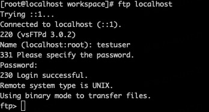

# Goland 配置远程 FTP Server

[TOC]

## Centos 安装并配置 FTP Server

### Step 1：安装 VSFTPD

1.更新

```shell
sudo yum update
```

2.使用 yum 安装 vsftpd

```shell
sudo yum install vsftpd
```

3.开启服务并设置开机启动

```shell
sudo systemctl start vsftpd
```

```shell
sudo systemctl enable vsftpd
```

4.开启防火墙

```shell
sudo firewall-cmd --zone=public --permanent --add-port=21/tcp
```

```shell
sudo firewall-cmd --zone=public --permanent --add-service=ftp
```

```shell
sudo firewall-cmd --reload
```

### Step 2：设置 VSFTPD

1.备份 vsftpd 配置文件

```shell
sudo cp /etc/vsftpd/vsftpd.conf /etc/vsftpd/vsftpd.conf.default
```

2.修改配置文件

```shell
sudo vim /etc/vsftpd/vsftpd.conf
```

3.禁止匿名用户登录、允许本地用户登录

```shell
anonymous_enable=NO

local_enable=YES
```

4.允许用户上传文件

```shell
write_enable=YES
```

5.限定上传目录

```shell
chroot_local_user=YES

allow_writeable_chroot=YES

```

---

***allow_writeable_chroot=YES*** 开启此选项后，可以在本地进行 FTP 连通性测试。

---

6.用户白名单/黑名单

* 开启白名单

```shell
userlist_enable=YES
```

* 白名单配置路径

```shell
userlist_file=/etc/vsftpd/user_list
```

* 名单模式

```shell
userlist_deny=NO
```

---
***userlist_deny=NO*** 白名单模式

***userlist_deny=YES*** 黑名单模式

---

7.重启 VSFTPD 服务

```shell
sudo systemctl restart vsftpd
```

### Step 3：创建 FTP 用户

1.创建新用户

```shell
sudo adduser testuser
```

```shell
sudo passwd testuser
```

2.将用户添加到 白名单中

```shell
sudo vim /etc/vsftpd/user_list
```

添加两行数据：第一行***用户名***，第二行***密码***

```shell
testuser
testuser
```

3.为该用户创建上传目录

```shell
sudo mkdir -p /home/testuser/ftp/upload
sudo chmod 550 /home/testuser/ftp
sudo chmod 750 /home/testuser/ftp/upload
sudo chown -R testuser: /home/testuser/ftp

```

### Step 4：FTP Server 本地测试

```shell
ftp localhost
```



---
***500 OOPS: chroot on vsftpd login*** 如何解决？

```shell
setsebool -P ftpd_full_access on
```

[参考文档](https://unix.stackexchange.com/questions/248920/500-oops-chroot-on-vsftpd-login)

---

## Goland 设置 FTP Server
